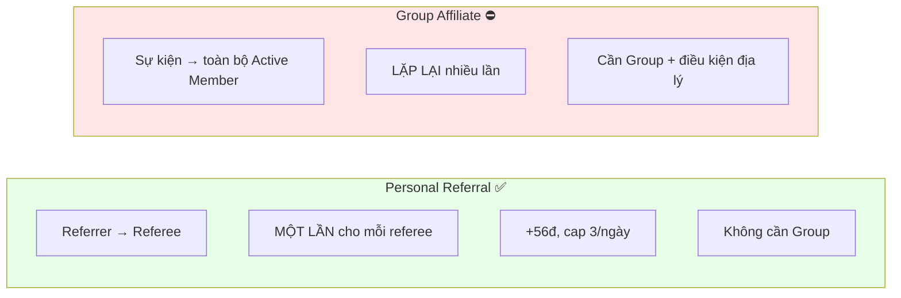
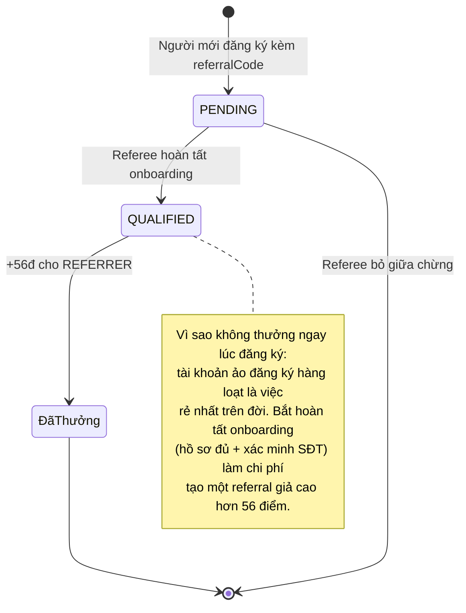
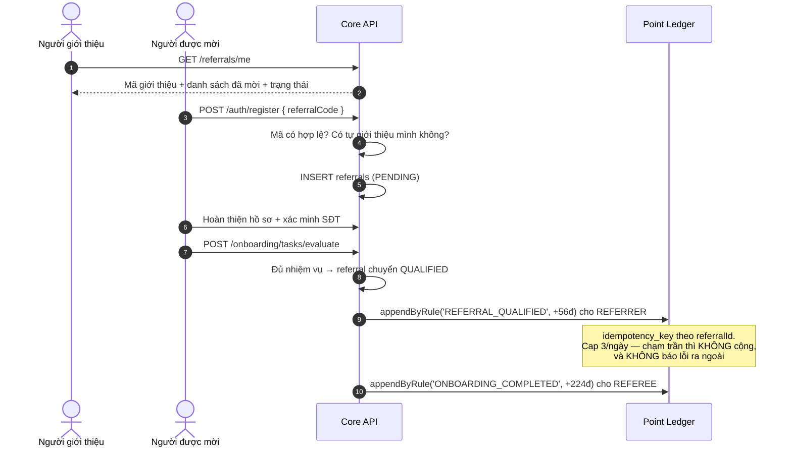
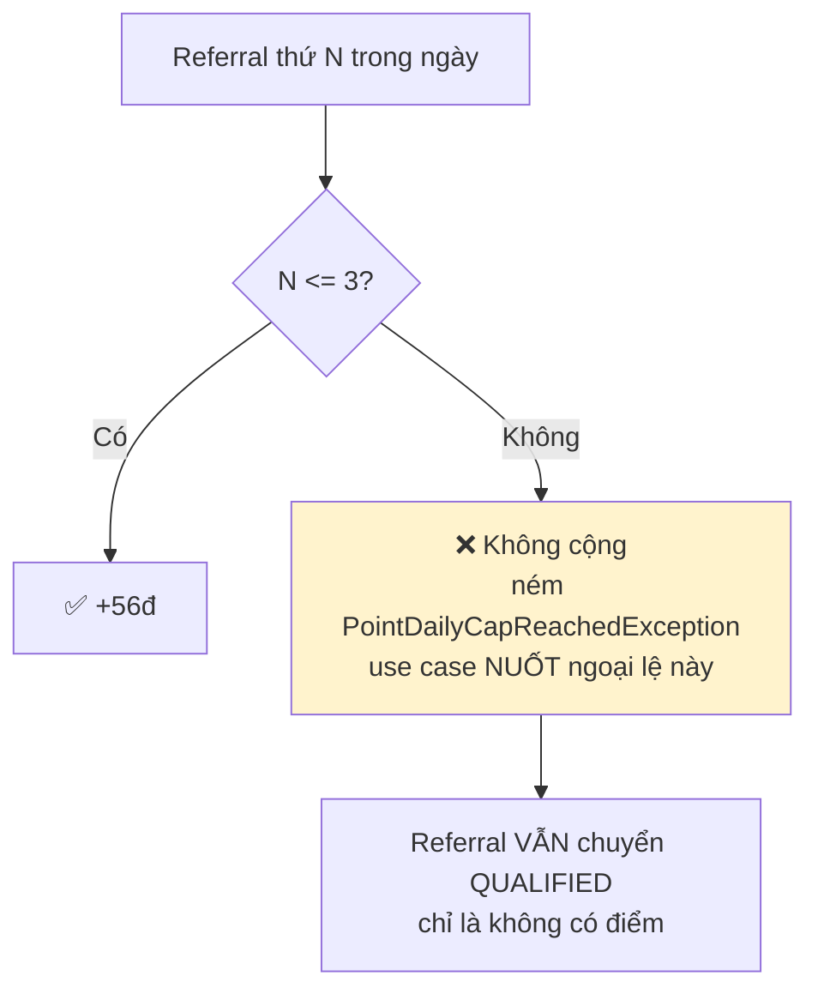

# 23 · Personal Referral

Trạng thái: ✅ **đã hiện thực**.

## 23.1 Khác Group Affiliate thế nào

## 23.2 Vòng đời một referral

## 23.3 Luồng đầy đủ

## 23.4 Cap theo ngày

> **Vì sao chạm trần vẫn cho referral thành công.** Quan hệ giới thiệu là dữ liệu thật, cần
> ghi dù không thưởng. Từ chối cả quan hệ chỉ vì hết quota điểm là làm mất dữ liệu để tiết
> kiệm một con số.

## Chỗ cần soát

1. **Referral chạm cap ngày thì mất điểm vĩnh viễn** — không có hàng đợi trả bù ngày hôm sau.
   Người mời 10 người trong một ngày chỉ được điểm cho 3. Đúng ý chưa?
2. **Chưa có thông báo cho người giới thiệu** khi referee của họ đủ điều kiện.
3. **Chưa chống được referral vòng tròn** giữa nhiều tài khoản do cùng một người tạo — mới chỉ
   chặn tự giới thiệu chính mình.
4. Nhiệm vụ duy trì rank đòi "N Personal Referral **hợp lệ**" mỗi quý — cần xác nhận "hợp lệ"
   ở đây chính là `QUALIFIED`.
