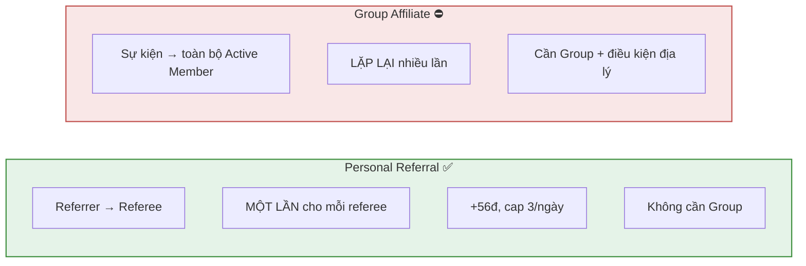
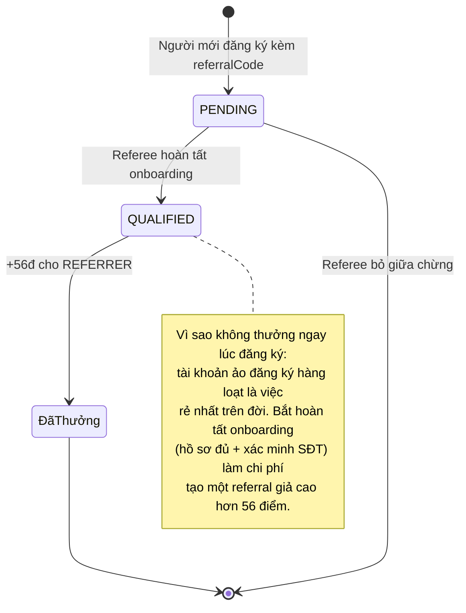
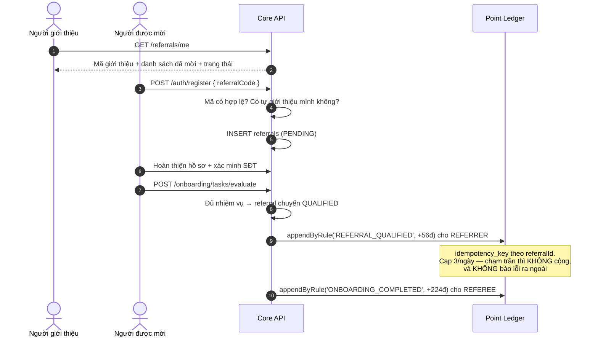
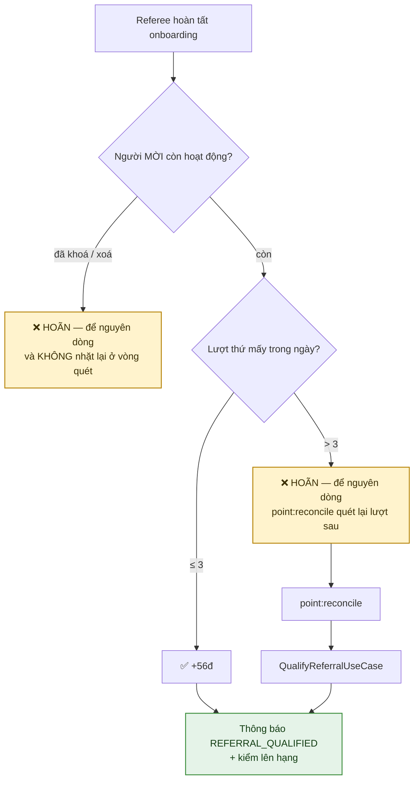
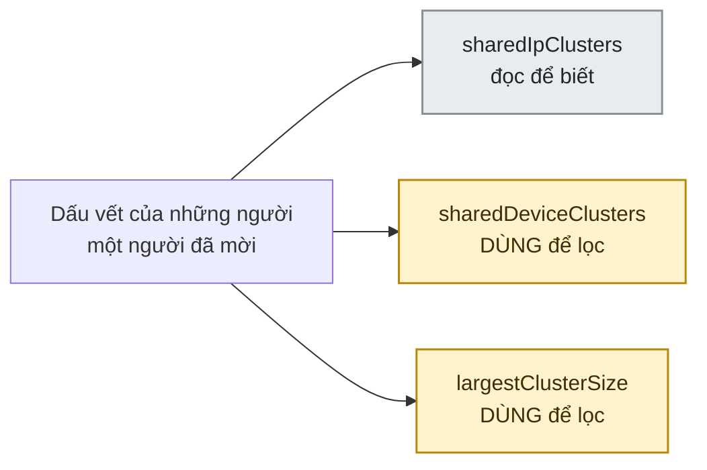
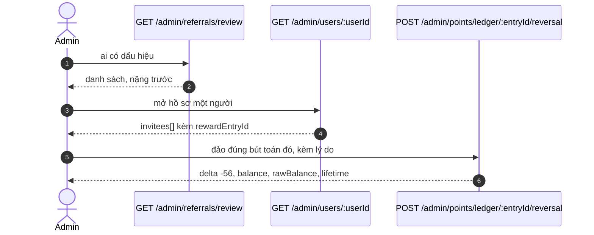

# 23 · Personal Referral

Trạng thái: ✅ **đã hiện thực**.

## 23.1 Khác Group Affiliate thế nào

## 23.2 Vòng đời một referral

## 23.3 Luồng đầy đủ

## 23.4 Trần theo ngày, và hai đường trả thưởng

> **Vì sao hoãn mà vẫn giữ dòng.** Quan hệ giới thiệu là dữ liệu thật, cần ghi dù không
> thưởng. Từ chối cả quan hệ chỉ vì hết quota điểm là làm mất dữ liệu để tiết kiệm một
> con số. Trigger `enforce_referral_qualification_transition` đòi `qualified_at` và
> `reward_entry_id` phải cùng xuất hiện trong MỘT lần ghi, nên ở tầng database "đã đủ
> điều kiện" đồng nghĩa với "đã trả thưởng" — hoãn là cách duy nhất không nói dối.
>
> **Vì sao `point:reconcile` phải đi qua use case, không qua repository.** Đường quét
> lại gọi `QualifyReferralUseCase`, cùng đường mà onboarding gọi. Trước 30/09 nó gọi
> thẳng `ReferralRepository.qualifyAndAward`, nên nó bỏ qua cả hai việc use case làm
> sau khi ghi sổ: gửi `REFERRAL_QUALIFIED`, và gọi `RankChangeNotifier`. Hệ quả đo
> được: **referral thứ 4 trở đi trong ngày** — tức đường bình thường của một người mời
> tích cực — được cộng 56 điểm hoàn toàn im lặng, và cú lên hạng từ những điểm đó cũng
> không ai nói. Hai mục "đã sửa" của bản soát trước (hoãn thay vì mất; thêm thông báo)
> **không ăn khớp với nhau**.
>
> **Vì sao kiểm người mời ở thời điểm TRẢ THƯỞNG, không chỉ lúc đăng ký.** Giữa hai
> mốc đó là cả quá trình onboarding của người được mời — vài ngày, đủ để Admin khoá
> một tài khoản farm. Đo được: tài khoản `BANNED` và đã xoá mềm vẫn nhận +56 điểm, và
> `point:reconcile` vá lại mãi. Nay `findPendingQualifications` cũng lọc theo vế đó,
> nếu không thì vòng quét nhặt lại một khoản sẽ không bao giờ được ghi, mỗi lượt một
> dòng log lỗi. Người bị treo **tạm** rồi được gỡ thì lượt đó quay lại — hoãn, không mất.

## 23.5 "Hợp lệ" cho nhiệm vụ hạng nghĩa là gì

Nhiệm vụ duy trì hạng đòi *N Personal Referral **hợp lệ*** mỗi quý. Hợp lệ = `qualified_at IS NOT NULL`
**và người được mời chưa bị khoá vĩnh viễn hay xoá**.

Vế thứ hai thêm ngày 30/09. Trước đó cả **năm** chỗ SQL của phân hệ hạng chỉ xét
`qualified_at`, và đo được: một người mời ba tài khoản, cả ba đủ điều kiện rồi cả ba bị
khoá vì là tài khoản ảo — bộ đếm vẫn ra 3, tức vẫn đủ nhiệm vụ của quý. Nói cách khác,
**chính việc Admin dọn tài khoản ảo không làm giảm thành tích của người tạo ra chúng.**

`<> 'BANNED'` chứ không `= 'ACTIVE'`: `SUSPENDED` là treo có thời hạn và tự về `ACTIVE`,
nên một người được mời bị treo bảy ngày vẫn là thành viên thật — xoá công của người mời
vì việc đó là phạt sai người.

Ba thứ **không** bị ảnh hưởng: quan hệ giới thiệu vẫn còn dòng, vẫn hiện ở
`GET /referrals/me`, và điểm đã trả không bị thu lại — sổ điểm là append-only, thu hồi
là việc của đường đảo bút toán có lý do.

## 23.6 `GET /referrals/me`

Trả mã, ba con số, **và danh sách người đã mời** (tối đa 50, mới nhất trước):

| Trường | Ý nghĩa |
| --- | --- |
| `code` | Mã giới thiệu — bất biến, gắn lúc đăng ký |
| `totalCount` | Số người đã đăng ký bằng mã |
| `qualifiedCount` | Trong đó bao nhiêu đã đủ điều kiện |
| `rewardedCount` | Bao nhiêu lượt thật sự được thưởng sau khi áp trần |
| `invitees[].status` | `PENDING` hoặc `QUALIFIED` |
| `invitees[].awardedPoints` | Số điểm **đã vào sổ** cho lượt đó, `null` khi chưa tính |

§23.3 vẽ endpoint này trả *"Mã giới thiệu + danh sách đã mời + trạng thái"* từ đầu, nhưng
trước 30/09 nó chỉ có ba con số. Ba con số nói được "bao nhiêu", không nói được "ai" —
nên người mời không biết ai đang kẹt ở `PENDING` để mà nhắc, và nhắc chính là việc duy
nhất họ còn làm được sau khi đã gửi mã.

`awardedPoints` đọc từ `point_ledger` theo `reward_entry_id`, **không** đọc lại
`point_rules`: rule là cấu hình động, nên đọc lại sẽ nói sai về những lượt đã trả trước
khi Admin đổi mức.

## 23.7 Dấu vết đăng ký, và diện Admin xem xét

`referrals.signup_ip_hash` và `signup_device_hash` có từ migration đầu tiên. Trước
30/09 **không dòng nào có giá trị** — và trigger coi hai cột đó là bất biến, nên chỉ
ghi được đúng lúc `INSERT`; vá sau cho dữ liệu cũ là không thể.

Nay ghi lúc đăng ký, băm bằng `hashSignupFingerprint` (HMAC-SHA256, pepper dùng chung
với `verified_phones`). Băm chứ không lưu thô vì bảng này **không xoá được**: lưu IP
thô ở đó là giữ lịch sử vị trí thô của người dùng vô thời hạn, cho một mục đích duy
nhất — so trùng — mà so trùng thì chỉ cần băm.

### Ba tín hiệu, đếm tách nhau

> **Vì sao IP không dùng để lọc.** Mạng di động Việt Nam dùng CGNAT: hàng nghìn người
> không liên quan gì nhau chia một địa chỉ IPv4. Thêm wifi gia đình, quán cà phê, tiệm
> net, ký túc xá. IP trùng là **chuyện thường**, nên một ngưỡng theo IP sẽ nổ với người
> dùng thật nhiều hơn với kẻ gian. Số cụm IP vẫn trả ra để Admin đọc cùng hai số kia.
>
> **Vì sao có cả cụm lớn nhất, không chỉ số cụm.** "Ba cụm, mỗi cụm hai người" và "một
> cụm mười một người" là hai hình dạng rất khác nhau — cái thứ hai đáng xem hơn nhiều
> nhưng lại có số cụm **nhỏ hơn**.
>
> Bản đầu (30/09) cộng cả hai loại thành MỘT con số. Cộng lại là làm mất đúng thứ để
> phân biệt một gia đình dùng chung mạng với một người mở mười tài khoản trên một máy,
> và một ngưỡng đặt trên tổng đó không có nghĩa gì.

### `GET /admin/referrals/review`

Hàng đợi soát, cùng hình dạng với `GET /admin/reports/reporters` và cờ Giver Accuracy:
đưa hồ sơ lên bàn Admin rồi dừng.

| Ngưỡng (khoá cấu hình động) | Mặc định | Ý nghĩa |
| --- | --- | --- |
| `referral.review_min_qualified` | 5 | Sàn mẫu. Dưới mức này cụm trùng không nói lên gì |
| `referral.review_min_device_clusters` | **0 = TẮT** | Số cụm thiết bị để vào diện xem xét |
| `referral.review_min_cluster_size` | **0 = TẮT** | Cụm lớn nhất từ bao nhiêu người |

Hai vế lọc là **HOẶC**, không phải VÀ: nhiều cụm nhỏ và một cụm rất lớn là hai hình
dạng của cùng một việc, đòi cả hai cùng vượt là bỏ sót cả hai.

> **Mặc định TẮT là một quyết định, không phải chỗ bỏ dở.** Dấu vết chỉ bắt đầu được
> ghi từ 30/09 nên **chưa ai biết "bình thường" trông như thế nào**, và một ngưỡng chọn
> trước khi có dữ liệu là phỏng đoán mặc áo chính sách — nó sẽ sai theo hướng hoặc
> không bao giờ nổ, hoặc nổ với mọi người. Khi đã có vài tuần dữ liệu thật thì chọn
> theo **phân vị**, đừng chọn theo cảm giác.
>
> Vẫn seed cả ba khoá để Admin **thấy cái núm**: một khoá chưa seed thì họ mở trang cấu
> hình ra và không có ô nào để sửa, nên "cấu hình động" thành ra phải deploy mới đổi
> được — đúng thứ `test:config-inventory` sinh ra để bắt.
>
> Endpoint trả kèm `threshold.enabled`, vì một mảng rỗng **vì chưa bật** khác hẳn một
> mảng rỗng **vì không có ai đáng xem** — và một mảng rỗng không tự phân biệt được hai
> câu đó.
>
> **Ba khoá INTEGER chứ không một khoá JSON.** `POST /admin/system-configs` hiện chỉ
> nhận `valueType: INTEGER`, nên một khoá hình JSON thì seed được, đọc được, mà không
> ai sửa được qua API — chỉ còn SQL tay. Đo được 01/10: bản đầu dùng một khoá JSON và
> lượt bật ngưỡng trả *"valueType hiện chỉ hỗ trợ INTEGER"*. Ba khoá cũng đúng lối
> `group.radius_meters.*` đã dùng, và mỗi khoá phải có tên trong
> `SupportedSystemConfigKeys` — thiếu đó thì Admin nhận *"key không nằm trong danh sách
> cấu hình được phép"*, đo được ở cùng lượt.

### KHÔNG tự động phạt

Lý do cụ thể, không phải sự thận trọng chung:

- **Dương tính giả là chắc chắn có.** Một gia đình dùng chung wifi, hai người yêu dùng
  chung điện thoại, mấy người đăng ký ở một tiệm net.
- **Số tiền là 56 điểm.** Chi phí của một lần chặn sai — người dùng thật im lặng mất
  khoản họ xứng đáng và không có cách nào hỏi vì sao — **cao hơn** chi phí trả cho một
  kẻ gian 56 điểm mà Admin đảo lại được.
- **`deviceId` do client tự sinh**, nên nó là tín hiệu **yếu**: ai muốn lách thì đổi mỗi
  lần. Giữ vì phần lớn người tạo tài khoản hàng loạt không lách, và một tín hiệu yếu vẫn
  hơn không có tín hiệu nào — miễn là không ai tự động hoá quyết định dựa vào nó.

Lượt đăng ký trước 30/09 luôn ra `0`, và `0` ở đó nghĩa là **"không biết"**, không phải
"sạch".

## 23.8 Thu hồi điểm khi xác minh là tài khoản ảo

Đường này **đã có sẵn và đã đúng** — thứ từng thiếu chỉ là cách đi tới nó.

`referrals.reward_entry_id` giữ đúng `entryId` mà endpoint đảo bút toán nhận, nhưng
trước 01/10 **không endpoint nào trả nó ra** — nên đường thu hồi có sẵn, đúng, và không
ai tới được.

> **Ca khó — "điểm đã bị tiêu rồi" — đã được thiết kế sẵn**, không cần cơ chế mới.
> Migration `1791100000000` ("Điểm âm ghi được") dựng `raw_balance` không có ràng buộc
> âm, cùng `CHECK (balance_after = GREATEST(0, raw_balance_after))`. Nên:
>
> | | |
> | --- | --- |
> | Nợ ghi ở | `raw_balance`, được phép âm |
> | `balance` | kẹp về 0 nên `CHK_user_point_balances_balance` không vỡ |
> | Hệ quả | Đổi quà đọc `balance`, nên **nợ tự chặn việc đổi** tới khi họ kiếm thật cho `raw_balance` leo lại trên 0 |
>
> Đo được trên Postgres thật 01/10: tiêu bớt còn 20 điểm rồi đảo một khoản 56 →
> `raw_balance = -36`, `balance = 0`, và `lifetime 168 → 112`.
>
> **`lifetime` bị trừ** là điều quan trọng thứ hai: nếu không thì sàn hạng của người đó
> giữ nguyên phần do điểm farm thổi lên, kể cả khi `rank.points_source = LIFETIME`. Mã
> nguồn phân biệt rõ hai việc: *"Hoàn KHÁC phạt. Phạt không được trừ lifetime — đó là
> viết lại lịch sử đóng góp. Nhưng hoàn một khoản thưởng ghi nhầm thì PHẢI trừ."*
>
> Khoá chống trùng `REVERSAL:<entryId>` nên bấm hai lần không trừ hai lần.

**KHÔNG tự động đảo khi khoá tài khoản.** Người ta bị khoá vì nhiều lý do không liên
quan gì tới farm — spam, cãi nhau, một vụ tranh chấp. Tự động đảo là phạt người giới
thiệu thật chỉ vì người họ mời về sau cư xử tệ. Giữ nó là một hành động có chủ ý, có
`reason` bắt buộc.

**Quà đã đổi rồi thì không mô hình hoá.** Đảo điểm là việc của sổ điểm; lấy lại một món
đồ là việc của con người. Ghi vào `reason` của lượt đảo để còn dấu vết. Dựng một khái
niệm "nợ bằng hiện vật" là tạo ra thứ không ai bảo trì.

## Chỗ cần soát

1. **Ngưỡng diện xem xét chưa bật, và cần Bên A chốt** sau khi có dữ liệu thật: bao
   nhiêu cụm thiết bị, cụm lớn nhất bao nhiêu người. Cố ý chưa chọn — xem §23.7.

   Và đòn mạnh hơn mọi heuristic, nếu farm thành vấn đề thật: **giảm trần 3 lượt/ngày**,
   hoặc **đòi người được mời hoàn tất một giao dịch thật** chứ không chỉ onboarding. Cả
   hai **không có dương tính giả nào** và dịch chuyển kinh tế của việc farm nhiều hơn mọi
   dấu vết đăng ký cộng lại. Dấu vết chỉ để *nhìn thấy*, không phải để *ngăn*.

2. **Ba hàng đợi soát đều không có trạng thái "đã xem rồi"** — hàng đợi này, hàng đợi
   `reports/reporters`, và cờ Giver Accuracy. Nên một ca dương tính giả hợp lệ (gia đình
   dùng chung wifi) sẽ hiện lại mỗi lần Admin mở màn hình. Chưa làm vì nó là một cơ chế
   dùng chung cho cả ba, và cách làm việc với hàng đợi là quyết định của Bên A — dựng một
   luồng chưa ai đồng ý là cách sinh ra bảng không ai dùng.

3. **Nhiều khoá `system_configs` seed sẵn mà KHÔNG sửa được qua Admin.** Hiện 22 khoá có
   dòng, `SupportedSystemConfigKeys` cho 16 — và đường ghi chỉ nhận `INTEGER`, nên mọi
   khoá hình JSON (`report.abuse`, `accuracy.giver`, `moderation.blocked_terms`…) chỉ đổi
   được bằng SQL tay. Không thuộc phân hệ này, nhưng phát hiện ở đây nên ghi lại.

4. **Không có phân trang cho `invitees`** ở cả hai đường đọc. Trần cứng 50, mới nhất
   trước. Đủ cho trang tóm tắt; sẽ thiếu nếu về sau có người mời vài trăm người.
