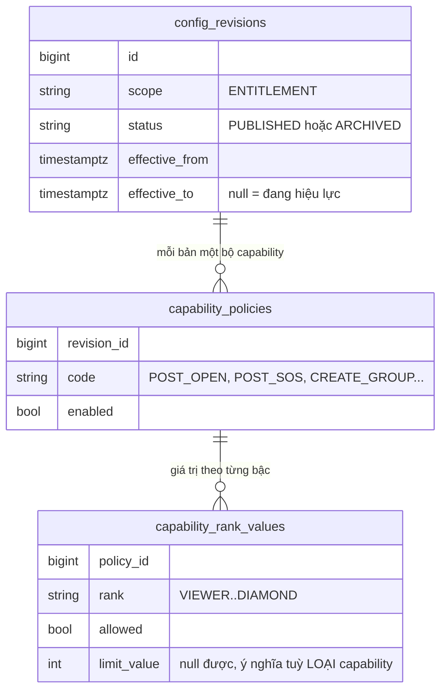
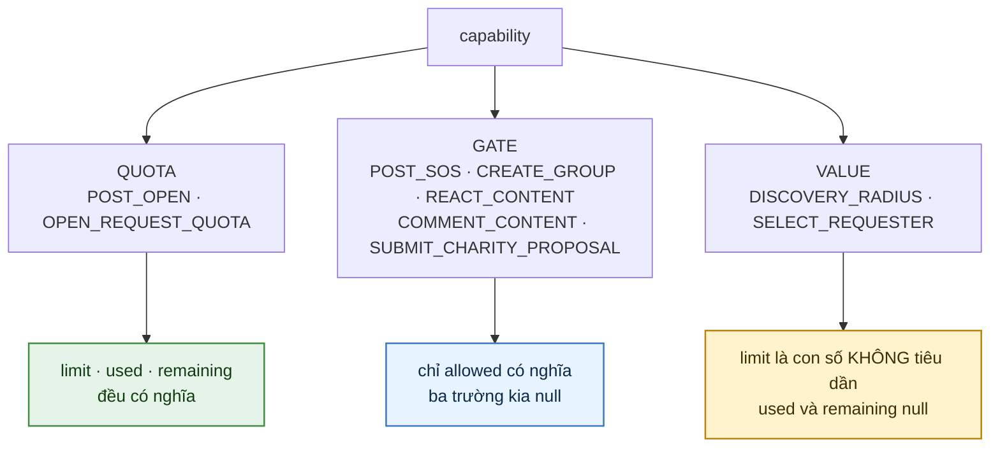
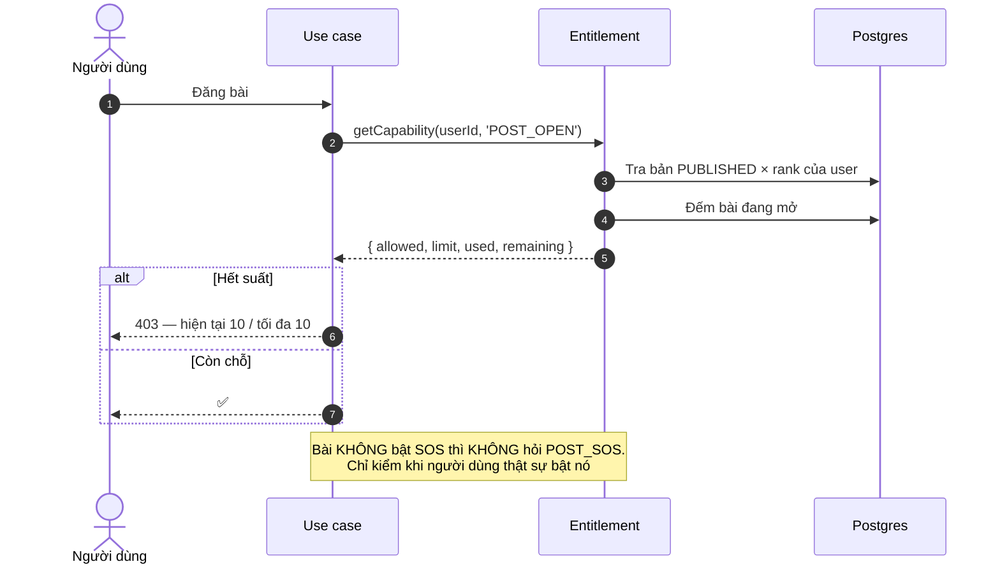
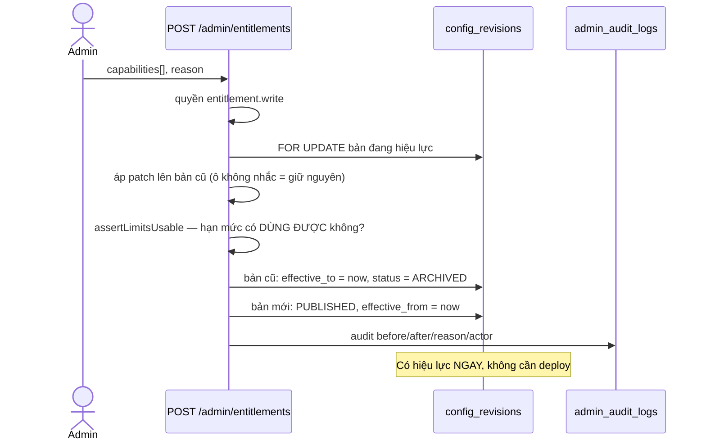
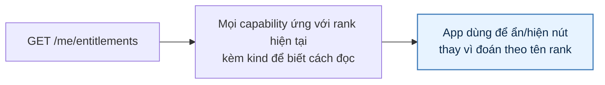

# 24 · Đặc quyền theo Rank (Entitlements)

Trạng thái: ✅ **đã hiện thực**. Đây là cơ chế thay cho việc hard-code `if (rank === 'SILVER')`.

## 24.1 Mô hình



> **Không có cột `value_type`.** Bản sơ đồ trước 01/10 vẽ
> `capability_policies { value_type "NUMBER hoặc BOOLEAN" }`. Cột đó chưa bao giờ tồn
> tại, và mỗi capability thật ra có **cả hai**: một `allowed` boolean và một
> `limit_value` số nullable, ở từng bậc.
>
> Khái niệm "capability này đọc như thế nào" là thật và cần — nhưng nó nằm ở **code**,
> trong `CapabilityKindByCode`, chứ không phải một cột. Vì "có bộ đếm hay không" là sự
> thật về code, không phải một lựa chọn cấu hình: đặt `kind: QUOTA` cho một capability
> không có bộ đếm thì `used` luôn bằng 0, và người dùng lại nhận một con số sai — đúng
> lỗi mà §24.6 bên dưới kể.

## 24.2 Ba LOẠI capability



Chỉ `QUOTA` có **bộ đếm thật** ở tầng dưới, và bộ đếm đó phải là **đúng cái** mà đường
chặn dùng — xem §24.6.

## 24.3 Chín capability đang có

| Capability | Loại | Viewer | Thành viên | Bạc | Vàng | Kim Cương | Đọc ở |
| --- | --- | ---: | ---: | ---: | ---: | ---: | --- |
| `POST_OPEN` — bài đang mở | QUOTA | 0 | 3 | 10 | 20 | 50 | `create-post`, `renew-post` |
| `OPEN_REQUEST_QUOTA` — yêu cầu đang mở | QUOTA | 0 | 5 | 10 | 20 | 30 | `create-gift-request` |
| `DISCOVERY_RADIUS` — bán kính (mét) | VALUE | 5.000 | 10.000 | 20.000 | 30.000 | 50.000 | `get-nearby-posts` |
| `POST_SOS` — đăng SOS | GATE | ✗ | ✗ | ✓ | ✓ | ✓ | `create-post`, `update-post` |
| `CREATE_GROUP` | GATE | ✗ | ✗ | ✗ | ✗ | ✓ | `group.use-cases` |
| `REACT_CONTENT` | GATE | ✗ | ✓ | ✓ | ✓ | ✓ | `content-reaction.use-cases` |
| `COMMENT_CONTENT` | GATE | ✗ | ✓ | ✓ | ✓ | ✓ | `content-comment.use-cases` |
| `SELECT_REQUESTER` | VALUE | 0 | 1 | 3 | 5 | 10 | ⚠️ **chưa ai đọc** |
| `SUBMIT_CHARITY_PROPOSAL` | GATE | ✗ | ✗ | ✗ | ✗ | ✓ | ⚠️ **chưa ai đọc** |

> Bản bảng trước 01/10 liệt **4** dòng, gọi `POST_OPEN` là `POST_QUOTA`, đánh
> `CREATE_GROUP` là ⛔ dù nó đã chạy, và thiếu hẳn năm capability. Mục "Chỗ cần soát"
> của bản đó — vốn đã là một lần sửa — lại liệt `POST_OFFER` và `POST_WANTED`, hai mã
> mà migration `1794300000000-MergePostQuotaIntoOne` đã gộp bỏ từ 26/09.
>
> `test:entitlement-inventory` nay canh chính bảng này: thêm capability vào database mà
> không khai ở code thì phép kiểm đỏ. Hai dòng ⚠️ ở trên phải nêu tên kèm **lý do**
> trong `DeclaredButUnread` mới không bị báo — xem §24.7.

## 24.4 Luồng kiểm quyền



> **`limit` là `null` trên một `QUOTA` nghĩa là 0, không phải "không giới hạn".**
> Ghi chú DTO trước 01/10 nói ngược lại, trong khi `create-post` và
> `create-gift-request` đều đọc `limit ?? 0`. Hai cách hiểu **ngược hẳn nhau** cho cùng
> một ô: Admin xoá trống ô định MỞ khoá thì thực tế là KHOÁ SẠCH cả bậc đó, và người
> dùng nhận thông báo "quota 0" không nói gì về cấu hình.
>
> Giữ lối fail-closed — một ô trống không được âm thầm bỏ mọi giới hạn — và chặn luôn
> việc tạo ra ô trống đó ở đường Admin ghi (§24.5). Lựa chọn ấy giờ nằm trong một hàm
> có tên, `resolveQuotaLimit`, thay vì một `?? 0` lặp ở hai chỗ.

## 24.5 Admin đổi lúc chạy



> **`assertLimitsUsable` chặn hai trạng thái TỰ MÂU THUẪN**, không phải hai lựa chọn
> chính sách — trả `422 ENTITLEMENT_LIMIT_INVALID`:
>
> | Ca | Vì sao chặn |
> | --- | --- |
> | `QUOTA` + `allowed: true` + `limit: null` | Ô trống bị đọc thành 0 → khoá sạch cả bậc đó |
> | `QUOTA` + `allowed: true` + `limit: 0` | "Cho phép nhưng hạn mức không" là hai câu đánh nhau; muốn cấm thì đặt `allowed: false`, đúng cách bậc VIEWER đang được seed |
>
> Kiểm **sau** khi áp patch chứ không trên payload: Admin gửi `allowed: true` mà không
> nhắc `limit` thì ô đó lấy `limit` cũ, và chỉ bản đã ghép mới nói được trạng thái cuối
> cùng có dùng được hay không.
>
> `GATE` thì không kiểm `limit`: dữ liệu seed có `COMMENT_CONTENT` bậc VIEWER mang
> `limit = 0` một cách vô hại, và bắt lỗi nó là ép Admin dọn một con số không ai đọc.
>
> **Bước "value hợp kiểu đã khai chưa?" ở sơ đồ cũ chưa bao giờ tồn tại** — đường ghi
> chỉ kiểm mã capability có thật. Mà cũng không có `value_type` nào để mà hợp kiểu.

> **Đóng bản cũ phải đặt CẢ `status = ARCHIVED`.** Trước 01/10 nó chỉ đặt `effective_to`,
> nên sau N lượt publish có N dòng đều mang `PUBLISHED` và chỉ một dòng thật sự đang
> chạy. Các đường đọc vẫn đúng vì chúng lọc cả khung thời gian — nhưng cột `status` thì
> nói sai, và §24.7 trả chính cột đó ra cho Admin đọc. Ràng buộc GIST chỉ cấm trùng
> *khung thời gian* nên nó không bắt được ca này; `test:entitlement-inventory` bắt.

## 24.6 `GET /me/entitlements` — và chỗ nó từng nói sai



> **Vì sao app không tự suy từ tên rank.** Admin đổi ngưỡng SOS xuống Thành viên thì app
> cũ vẫn ẩn nút vì nó hard-code "Bạc trở lên". Hỏi server là cách duy nhất để hai bên
> không lệch.

Nhưng chính vì app tin endpoint này, một con số sai ở đây là một cái nút sai trên máy
người dùng. Trước 01/10 đường đọc là:

```ts
function isPostCapability(code: string): boolean { return code === 'POST_OPEN'; }
const used = isPostCapability(row.code) ? openPosts : 0;
```

tức **mọi capability trừ `POST_OPEN` đều báo `used: 0`**. Đo được trên dịch vụ sống, cùng
một thời điểm:

| | |
| --- | --- |
| Database | **5** yêu cầu đang mở |
| `POST /posts/:id/requests` | **403** — *"Bạn đang có 5/5 yêu cầu chưa ngã ngũ"* |
| `GET /me/entitlements` | `OPEN_REQUEST_QUOTA limit=5` **`used=0 remaining=5`** |

App hiện nút "Xin nhận" cho người đã hết suất, rồi họ ăn 403. Server chặn đúng — đây là
lời nói dối ở tầng hiển thị.

Kèm theo, `DISCOVERY_RADIUS` trả `remaining: 10000`: "còn lại 10 km" không nói lên gì.

### Nay

- Mỗi `QUOTA` có một **bộ đếm thật**, và bộ đếm đó là **đúng cái** mà đường chặn dùng:
  `OPEN_REQUEST_QUOTA` gọi thẳng `countOpenByRequester`, không chép lại câu SQL. Bản chép
  thứ hai sẽ lệch ở lần sửa sau, và khi lệch thì con số app thấy lại khác con số server
  chặn theo — đúng lỗi đang được sửa, ở một chỗ mới.
- `GATE` và `VALUE` trả `used: null`, `remaining: null`. **`null` chứ không `0`**: "không
  đếm" và "đã dùng 0" là hai câu khác nhau mà một số 0 không tự phân biệt được.
- Thêm `kind` để app biết đọc ba trường kia thế nào.

> ⚠️ **Đổi hợp đồng API.** `used` từ `number` thành `number | null`, và thêm `kind`.
> Client đang vẽ thanh tiến độ từ `used` phải xử `null` — nhưng con số cũ ở đó vốn là số
> sai, nên không có cách nào giữ nguyên hợp đồng mà vẫn nói thật.

## 24.7 `GET /admin/entitlements/history`

Các bản chính sách đã từng hiệu lực, mới nhất trước, kèm khung thời gian, lý do đổi, và
số capability trong bản đó.

```text
#4 PUBLISHED  đến=đang mở                cap=9
#3 ARCHIVED   đến=2026-10-01T09:05:48    cap=9
#2 ARCHIVED   đến=2026-10-01T09:02:45    cap=9
#1 ARCHIVED   đến=2026-10-01T04:15:09    cap=7   ← bản đầu chỉ có 7 capability
```

Dữ liệu này **có đủ từ đầu**: `capability_policies.revision_id` trỏ `config_revisions`,
và bảng đó giữ `effective_from`/`effective_to` cùng `PUBLISHED`/`ARCHIVED` — đúng cơ chế
`system_configs` dùng. Thiếu duy nhất một đường đọc, nên câu **"bài bị từ chối vì quota
thì lúc đó quota là bao nhiêu"** chỉ trả lời được bằng SQL tay — đúng vào lúc tệ nhất,
khi có người khiếu nại.

`capabilityCount` cho thấy bản nào thêm mã mới: 7 → 9 là lượt thêm `REACT_CONTENT` và
`COMMENT_CONTENT`.

## Chỗ cần soát

1. ⚠️ **Mọi con số là giả định chờ Bên A** — quota bài, quota yêu cầu, ngưỡng SOS, bán
   kính theo bậc. Đổi không cần deploy, nhưng đang chạy bằng giả định.
2. 🟡 **`SELECT_REQUESTER` khai mà chưa ai đọc**, hạn mức 1/3/5/10 theo bậc. Không ai biết
   **đơn vị** của nó: mỗi bài được chọn mấy người, hay mỗi ngày? Nối nó đòi chốt nghiệp
   vụ trước — đoán sai là đặt một cái trần người dùng không hiểu. Đang được
   `test:entitlement-inventory` ghi là nợ, nên nó không lặng lẽ nằm đó nữa.
3. ✅ **`SUBMIT_CHARITY_PROPOSAL` đã có chỗ đọc (03/10)** — `CreateCharityCampaignUseCase`
   dùng nó làm cổng BR-CHARITY-01 (chỉ Kim Cương gửi được hồ sơ hoạt động). Giá trị seed
   từ `1790100000000` đúng như cần, nên không phải thêm migration nào — và **không được**
   thêm mã mới cho cùng việc, vì hai dòng cho một quyết định là cách để Admin tắt một
   dòng rồi tưởng đã khoá.
4. **Chat không đi qua capability** — cổng dùng `ProfileGate.assertComplete`, nên không
   đặt được hạn mức chat theo bậc. Hiện trần chat là hằng trong code (30/phút, 500/ngày),
   giống trần bình luận (10/phút, 200/ngày). Chuyển chúng sang capability là một việc
   thật, nhưng cần Bên A chốt có muốn phân biệt theo bậc hay không — nếu không thì một
   hằng có tên vẫn tốt hơn một ô cấu hình không ai đổi.
5. **Chưa có capability giới hạn dung lượng lưu trữ** theo bậc, dù F59 đã theo dõi dung
   lượng. Cần Bên A cho con số trước khi làm.
6. **Không có kiểm KHOẢNG cho `limit`**, chỉ kiểm tính nhất quán. `system_configs` có
   `SystemConfigValueRanges` vì ở đó mỗi khoá có một cận cứng ở tầng dưới; ở đây đơn vị
   mỗi capability một khác (số bài, số yêu cầu, mét) nên một khoảng chung không có nghĩa.
   Đặt `POST_OPEN = 100000` vẫn qua được — nó không làm sập gì, chỉ là một chính sách lạ.
