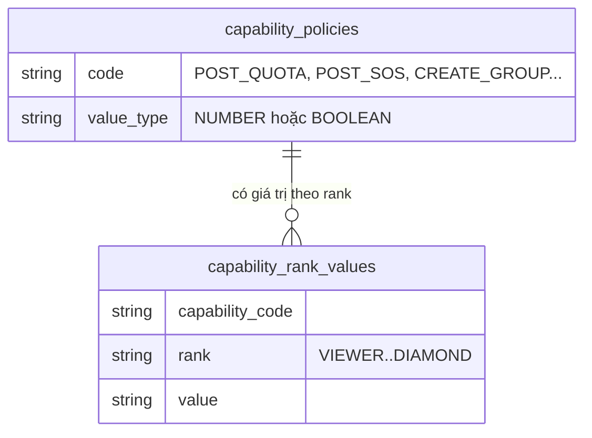
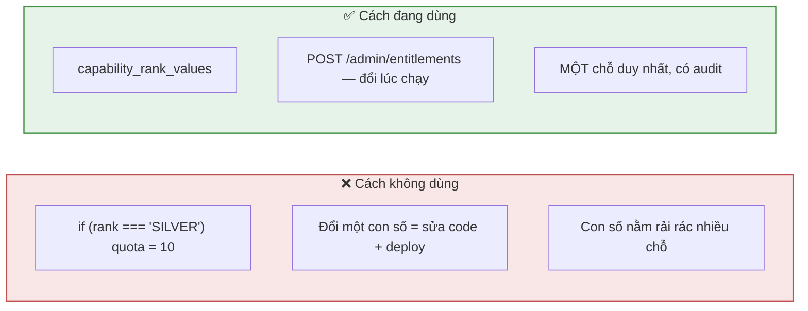
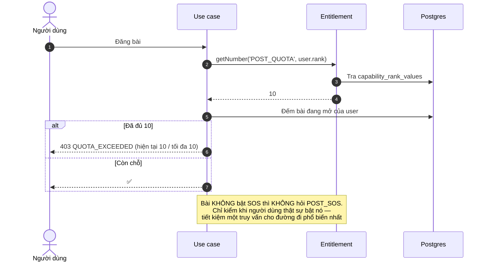
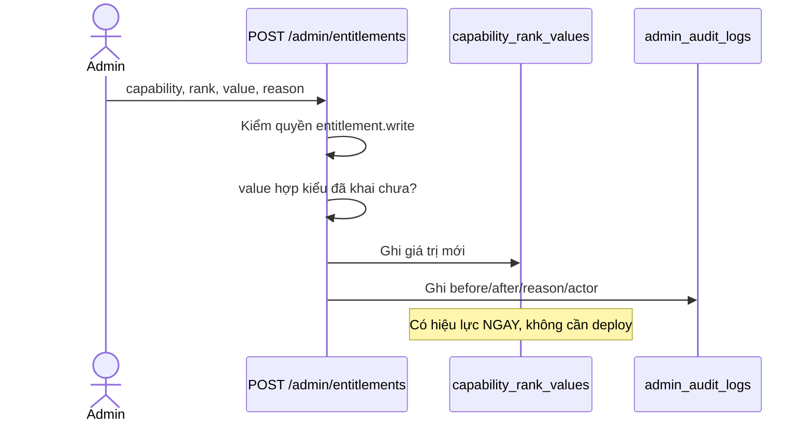
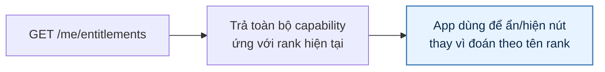

# 24 · Đặc quyền theo Rank (Entitlements)

Trạng thái: ✅ **đã hiện thực**. Đây là cơ chế thay cho việc hard-code `if (rank === 'SILVER')`.

## 24.1 Mô hình

## 24.2 Vì sao không hard-code

## 24.3 Bảng giá trị hiện tại

| Capability | Viewer | Thành viên | Bạc | Vàng | Kim Cương |
| --- | ---: | ---: | ---: | ---: | ---: |
| `POST_QUOTA` — bài đang mở | 0 | 3 | 10 | 20 | 50 |
| `POST_SOS` — đăng SOS | ✗ | ✗ | ✓ | ✓ | ✓ |
| `CREATE_GROUP` ⛔ | ✗ | ✗ | ✗ | ✗ | ✓ |
| `OPEN_REQUEST_QUOTA` — yêu cầu đang mở | 0 | 5 | 10 | 20 | 30 |

> ⚠️ Toàn bộ con số này là **baseline giả định**, chờ Bên A xác nhận.

## 24.4 Luồng kiểm quyền

## 24.5 Admin đổi lúc chạy

## 24.6 Người dùng xem quyền của mình

> **Vì sao app không tự suy từ tên rank.** Admin đổi ngưỡng SOS xuống Thành viên thì app cũ
> vẫn ẩn nút vì nó hard-code "Bạc trở lên". Hỏi server là cách duy nhất để hai bên không lệch.

## Chỗ cần soát

1. ⚠️ **Mọi con số là giả định chờ Bên A.**
2. ✅ **`OPEN_REQUEST_QUOTA` đã có** (25/09) — giới hạn số yêu cầu xin nhận đang mở, cần từ khi
   mỗi yêu cầu đầu tiên mở một đồng hồ 7 ngày.
3. **Chưa có capability cho chat và tạo Group** — cổng F07 và quyền tạo Group chưa đi qua cơ
   chế này.
4. **Không có lịch sử phiên bản** như `system_configs` — chỉ có audit log. Khi một bài bị từ
   chối vì quota, không tra được lúc đó quota là bao nhiêu.
5. Chưa có capability cho **giới hạn dung lượng lưu trữ** theo rank, dù F59 có theo dõi
   dung lượng.
