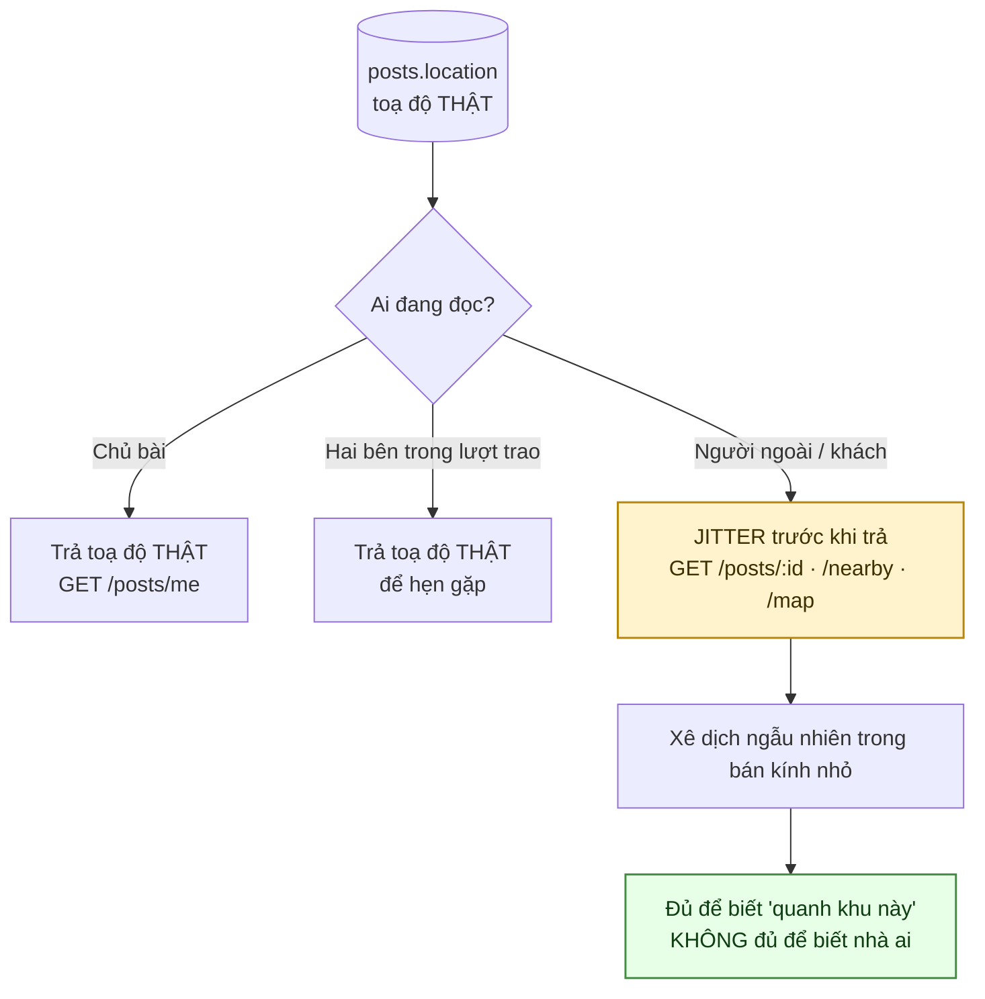
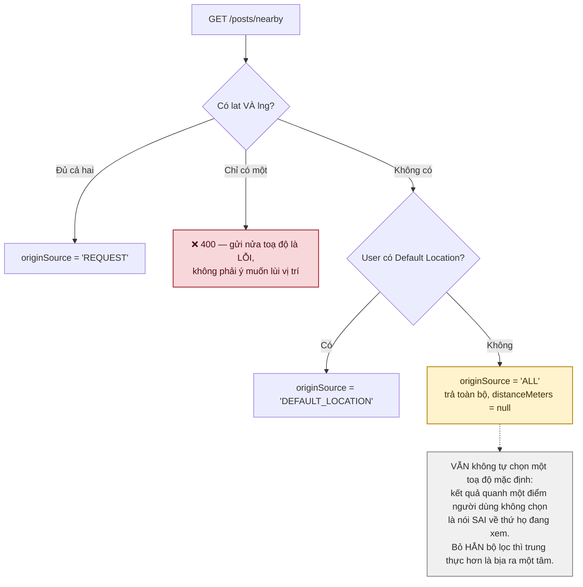
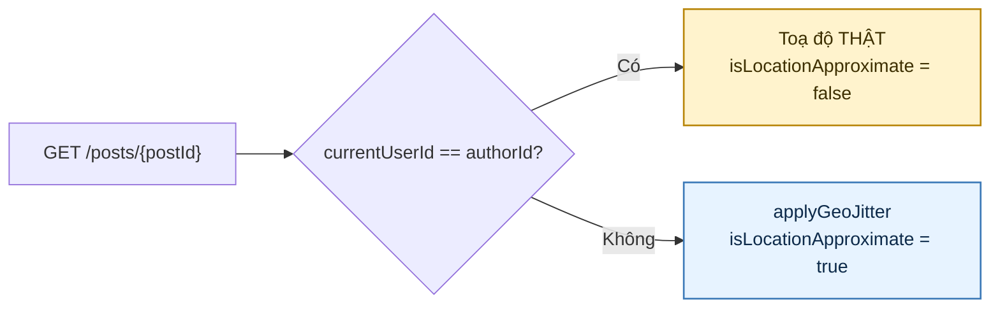
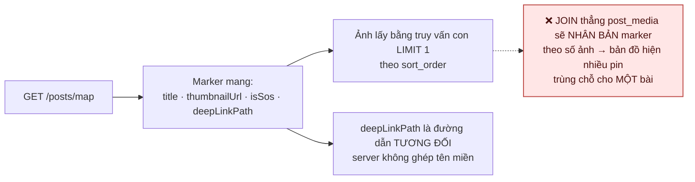
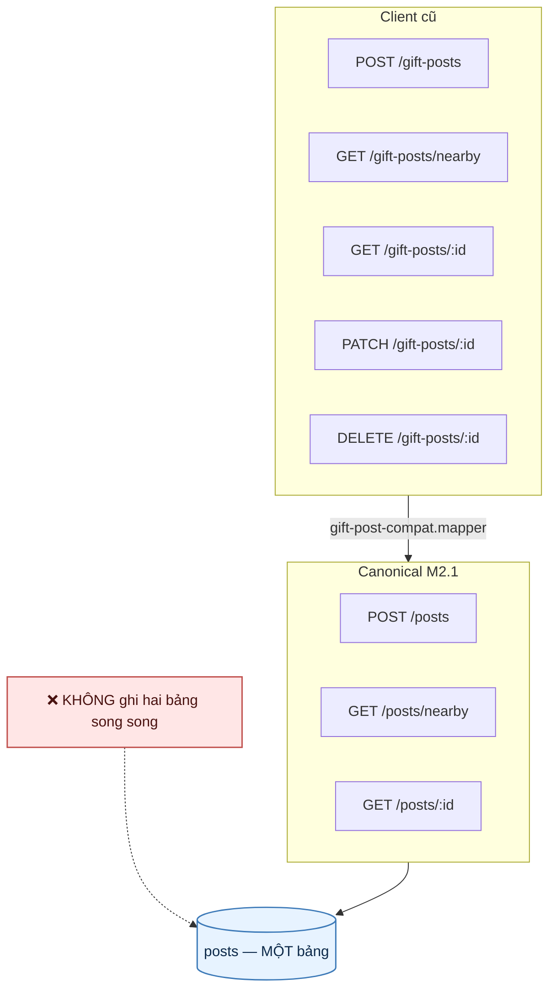
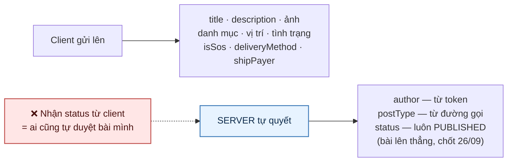

# 25 · Riêng tư vị trí & lớp tương thích bài cũ

Hai chuyện khác nhau nhưng cùng nằm ở đường đọc bài, nên gộp một sơ đồ.

## 25.1 Toạ độ jitter — không bao giờ trả vị trí thật ra công khai

Trạng thái: ✅ **đã hiện thực**.

> **Vì sao bắt buộc.** Bài "tặng tủ lạnh" kèm toạ độ chính xác là địa chỉ nhà một người, công
> khai cho bất kỳ ai mở app. Jitter ở tầng đọc chứ không ở tầng ghi — dữ liệu thật vẫn cần
> cho việc tính khoảng cách và hẹn gặp.
>
> **Không dùng route public để lấy vị trí thật.** Nếu có màn hình nào cần toạ độ chính xác,
> nó phải đi đường riêng có kiểm quyền, không phải đọc ké endpoint công khai.

## 25.2 Dự phòng vị trí (F26)

## 25.2b Ngoại lệ DUY NHẤT — chính chủ xem bài của mình

> **Vì sao mở ngoại lệ này (chốt 28/09).** Làm nhiễu toạ độ là để che chỗ ở của người đăng
> khỏi người lạ — che nó khỏi chính họ thì không bảo vệ ai. Chủ bài mở bài mình lên sửa mà
> thấy điểm ghim lệch vài trăm mét sẽ kéo nó về "đúng chỗ" theo cái họ nhìn thấy, và mỗi lần
> sửa là vị trí thật trôi thêm một đoạn. `GET /posts/me` đã trả toạ độ thật từ trước vì đúng
> lý do đó; đây chỉ là bù nốt đường còn thiếu.
>
> Ngoại lệ này KHÔNG áp cho `/posts/nearby`, `/posts/map` hay bất kỳ kênh quét nào — ở đó mọi
> bài đều là bài của người khác.

## 25.3 Thẻ xem nhanh trên bản đồ (F29)

## 25.4 Lớp tương thích `/gift-posts`

Trạng thái: ✅ đang chạy trong **compatibility window**.

> `gift-post-compat.mapper.ts` **hardcode `reactionCount` về 0** — đó là chủ ý. Client cũ không
> biết đến cảm xúc, và trả số thật vào một trường nó không hiểu chỉ gây nhầm.

## 25.5 Ai quyết trường nào

## Chỗ cần soát

1. **Bán kính jitter là hằng trong code**, chưa đưa ra cấu hình. Vùng nông thôn bán kính đó
   có thể vẫn chỉ ra đúng một nhà.
2. **Compatibility window chưa có hạn chót.** Không ai nói bao giờ gỡ `/gift-posts`.
3. **Chưa có endpoint trả vị trí thật cho hai bên trong lượt trao** — hiện họ hẹn nhau qua
   chat bằng cách tự gõ địa chỉ.
4. Jitter dùng **ngẫu nhiên mỗi lần gọi** hay cố định theo bài? Nếu ngẫu nhiên mỗi lần, gọi
   nhiều lần rồi lấy trung bình sẽ ra gần đúng vị trí thật.
