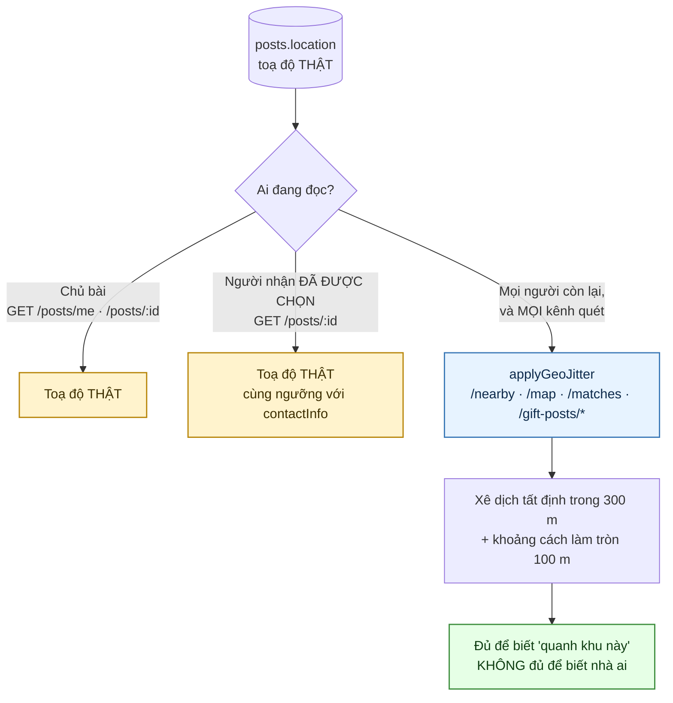
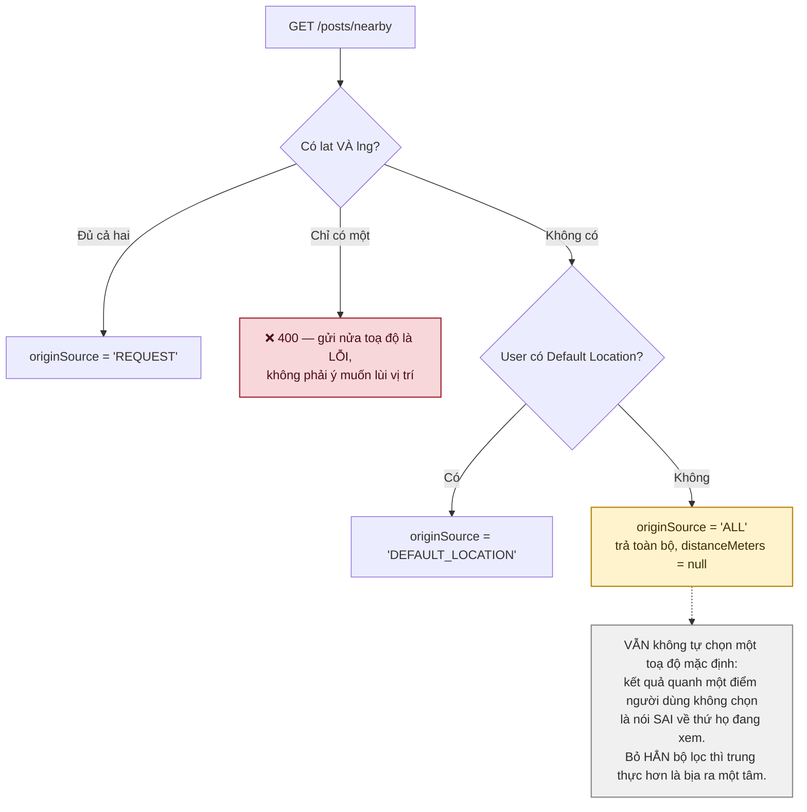
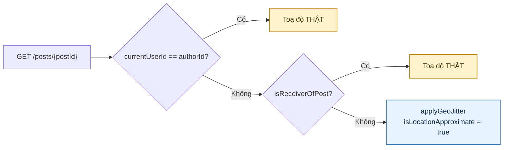
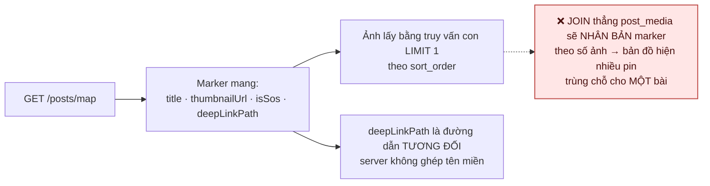
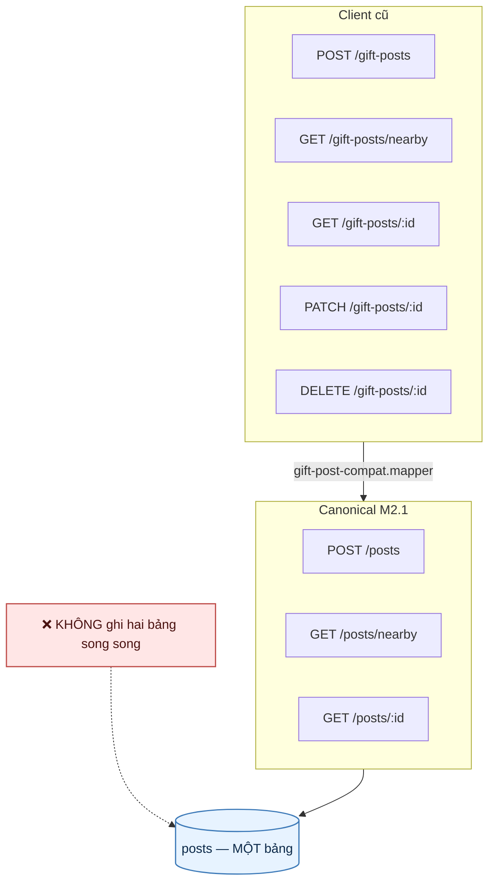
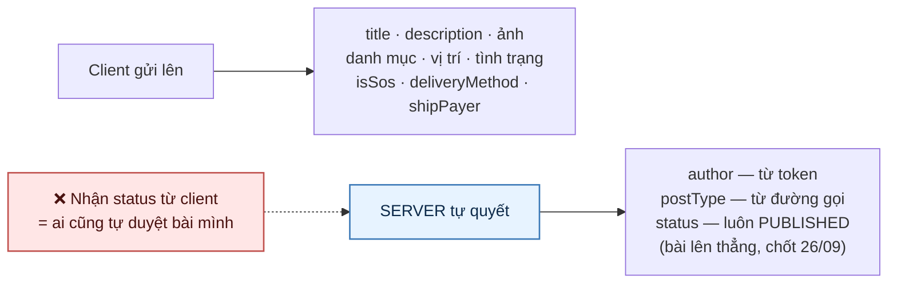

# 25 · Riêng tư vị trí & lớp tương thích bài cũ

Hai chuyện khác nhau nhưng cùng nằm ở đường đọc bài, nên gộp một sơ đồ.

## 25.1 Toạ độ jitter — ai thấy thật, ai thấy nhiễu

Trạng thái: ✅ **đã hiện thực**.

> **Vì sao bắt buộc.** Bài "tặng tủ lạnh" kèm toạ độ chính xác là địa chỉ nhà một người, công
> khai cho bất kỳ ai mở app. Jitter ở tầng đọc chứ không ở tầng ghi — dữ liệu thật vẫn cần
> cho việc tính khoảng cách và hẹn gặp.

### Ngoại lệ người nhận đã được chọn — thêm 01/10

Đặc tả mục 1.3 nói *"chỉ người đã được duyệt nhận mới biết địa chỉ chính xác"*. Trước 01/10
câu đó **chưa từng chạy cho toạ độ**:

- đường canonical `GET /posts/:postId` chỉ có ngoại lệ **chủ bài** (`!isAuthor`);
- đường legacy `GET /gift-posts/:id` mang một tham số `canViewExactLocation` **hardcode
  `false`** ở controller, kèm ghi chú *"Khi có auth-lib, giá trị này được suy ra từ trạng thái
  đơn xin"* — auth-lib đã có từ lâu, và nhánh đó vẫn chết. Tệ hơn: use case có docblock khẳng
  định quy tắc, nên ai đọc file đều kết luận mục 1.3 đã hiện thực.

> **Và ngưỡng mới không phải một lựa chọn mới.** Hệ đã trả `contactInfo` — **số điện thoại VÀ
> địa chỉ dạng chữ** — cho đúng người nhận đó, qua `isReceiverOfPost` (giao dịch
> `ACCEPTED`/`DELIVERING`/`COMPLETED`). Nhưng pin trên bản đồ họ thấy vẫn lệch ~300 m: app đưa
> họ số nhà rồi chỉ sai chỗ để đi tới.
>
> Nên toạ độ nay dùng **đúng** ngưỡng ấy, không đặt ngưỡng thứ hai. Hai ngưỡng khác nhau cho
> cùng một cặp người là một sự tuỳ ý khó giải thích, và cái bị giữ lại lại đúng là cái họ cần
> để tìm đường. Một lượt gọi `isReceiverOfPost` dùng cho cả hai — hai lần gọi là hai cơ hội
> để hai ngưỡng trôi lệch nhau về sau.

**Ngoại lệ KHÔNG áp cho kênh quét** — `/posts/nearby`, `/posts/map`, `/posts/:id/matches` — vì
ở đó mọi bài đều là bài của người khác. Và **không** áp cho `/gift-posts/:id`: route đó là
`@Public()` nên không có danh tính người gọi để suy ra quy tắc. Client cần toạ độ thật phải
dùng đường canonical. Tham số chết đã được bỏ.

## 25.2 Dự phòng vị trí (F26)

## 25.2b Hai ngoại lệ, và vì sao mỗi cái tồn tại

> **Chủ bài (chốt 28/09).** Làm nhiễu toạ độ là để che chỗ ở của người đăng khỏi người lạ —
> che nó khỏi chính họ thì không bảo vệ ai. Chủ bài mở bài mình lên sửa mà thấy điểm ghim lệch
> vài trăm mét sẽ kéo nó về "đúng chỗ" theo cái họ nhìn thấy, và mỗi lần sửa là vị trí thật
> trôi thêm một đoạn. `GET /posts/me` đã trả toạ độ thật từ trước vì đúng lý do đó.
>
> **Người nhận đã được chọn (chốt 01/10).** Đặc tả mục 1.3, và cùng ngưỡng đã mở cho
> `contactInfo` — xem §25.1. Họ đã có số nhà; giữ lại cái pin chỉ khiến họ đi sai chỗ.

Cả hai KHÔNG áp cho `/posts/nearby`, `/posts/map` hay bất kỳ kênh quét nào — ở đó mọi bài đều
là bài của người khác.

## 25.3 Thẻ xem nhanh trên bản đồ (F29)

## 25.4 Lớp tương thích `/gift-posts`

Trạng thái: ✅ đang chạy trong **compatibility window**.

> `gift-post-compat.mapper.ts` **hardcode `reactionCount` về 0** — đó là chủ ý. Client cũ không
> biết đến cảm xúc, và trả số thật vào một trường nó không hiểu chỉ gây nhầm.

## 25.5 Ai quyết trường nào

## Chỗ cần soát

1. ⚠️ **Mục này ghi SAI, sửa 01/10.** Câu cũ nói *"Bán kính jitter là hằng trong code, chưa đưa
   ra cấu hình"*. Thực tế nó là biến môi trường `GEO_JITTER_RADIUS_METERS`, mặc định **300 m**,
   có cả trong `.env.example`; `DefaultJitterRadiusMeters` ở `persistency-lib` là giá trị lùi khi
   không đặt.

   Hai điều đáng lo thì hẹp hơn và khác hẳn:

   - Nó là **biến môi trường**, nên đổi phải deploy — không như `system_configs` đổi được lúc
     chạy. Với một núm riêng tư mà có ngày cần siết nhanh thì đó là một khoảng chờ thật.
   - Nó là **một bán kính chung** cho cả thành phố lẫn nông thôn. Ở vùng thưa, 300 m vẫn có thể
     chỉ ra đúng một nhà.

   **Chưa chuyển sang cấu hình động, và đó là chủ ý:** một bán kính Admin hạ được lúc chạy thì
   cũng **nâng lên 0 được lúc chạy**, tức tắt sạch lớp bảo vệ bằng một ô số. Muốn làm thì phải
   có sàn cứng, và sàn đó là con số Bên A phải chốt — không phải thứ tôi đặt thay.

2. **Compatibility window chưa có hạn chót.** Không ai nói bao giờ gỡ `/gift-posts`.

3. ✅ **Đã làm 01/10.** Người nhận đã được chọn nay thấy toạ độ thật trên `GET /posts/:postId`,
   cùng ngưỡng đã mở cho `contactInfo`. Câu cũ ở đây — *"chưa có endpoint trả vị trí thật cho hai
   bên, hiện họ hẹn nhau qua chat bằng cách tự gõ địa chỉ"* — đúng một nửa: hệ **đã** trả
   `contactInfo.address` cho người nhận từ trước, chỉ toạ độ là chưa. Xem §25.1.

4. ✅ **CỐ ĐỊNH theo bài** (đáp án đã có trong code, ghi lại 30/09).
   `applyGeoJitter(point, seed, radius)` nhận `seed = post.globalId` rồi sinh số ngẫu nhiên
   **tiền định** từ hạt đó (FNV-1a băm hạt, xorshift32 sinh số), nên gọi bao nhiêu lần cũng ra
   đúng một điểm — phép lấy trung bình không thu được gì. Đo 01/10: gọi ba lần, cả ba ra
   `21.026767425851578 / 105.83544352598575`.

   Hai lớp, không phải một: `bucketDistance` còn làm tròn khoảng cách trả ra kênh công khai về
   bội số 100 m (`PublicDistanceBucketMeters`), để ba lần truy vấn từ ba chỗ khác nhau không
   giải tam giác ra một điểm mà chỉ ra một vùng.

   Câu hỏi này nằm treo trong tài liệu dù code đã trả lời — nên nếu ai đó "sửa" `applyGeoJitter`
   thành ngẫu nhiên mỗi lần vì tưởng như vậy an toàn hơn, họ sẽ phá đúng cái bảo vệ này.

5. **Ô bản đồ nhiều bài vẽ ở TÂM Ô, không phải trọng tâm** — vì trọng tâm của hai bài cùng một
   địa chỉ chính là địa chỉ đó. Ghi lại ở đây vì nó dễ bị "tối ưu" thành trọng tâm cho đẹp.
