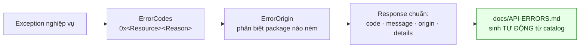
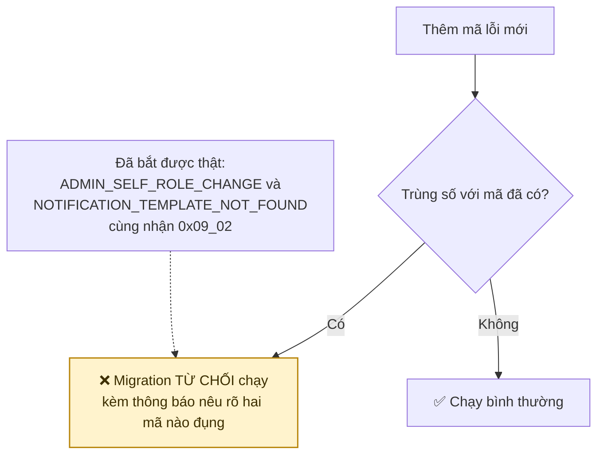
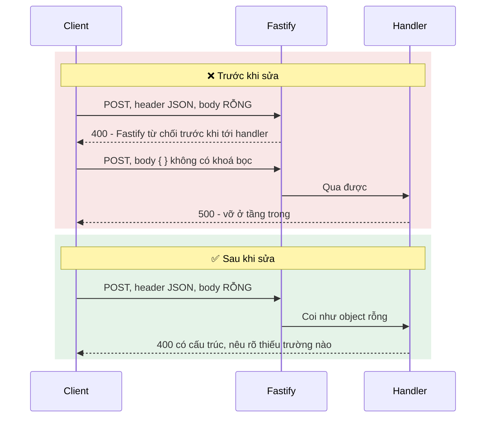
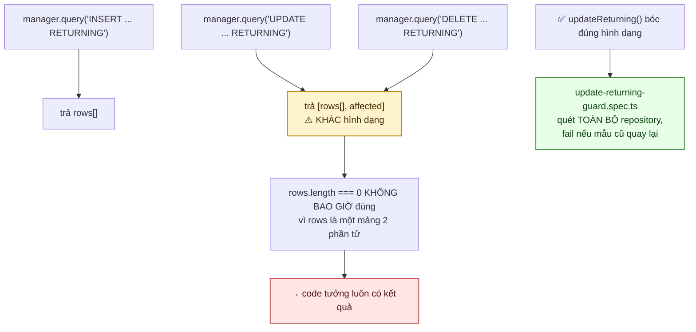
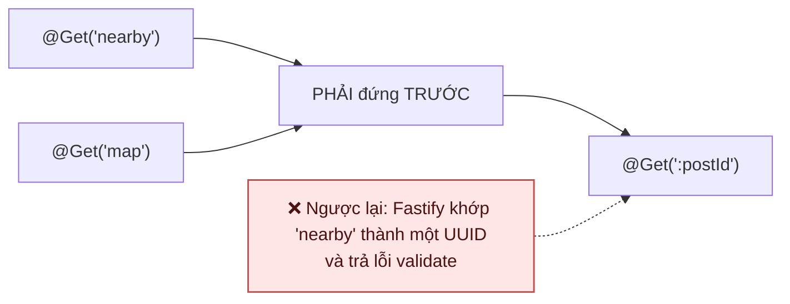
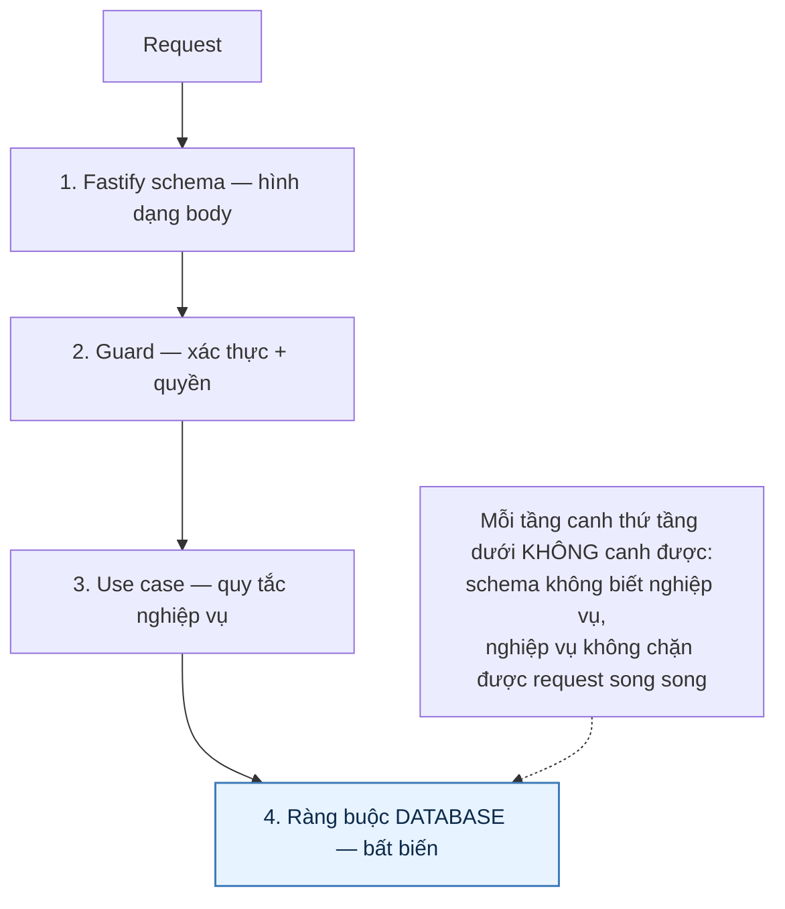

# 26 · Quy ước API & xử lý lỗi

Trạng thái: ✅ **đã hiện thực**, gồm hai cái bẫy đã sửa và có test canh.

## 26.1 Hình dạng một lỗi

66 mã lỗi, chia 9 nhóm:

| Nhóm | Phạm vi |
| --- | --- |
| `0x01` | Bài đăng cho tặng |
| `0x02` | Yêu cầu xin đồ |
| `0x03` | Người dùng |
| `0x04` | Phiên đăng nhập, OTP, đặt lại mật khẩu |
| `0x05` | Danh mục |
| `0x06` | Canonical bài đăng M2 |
| `0x07` | Point / Rank / Referral M4 |
| `0x08` | Giao dịch tặng/nhận M3 |
| `0x09` | Quản trị RBAC |

> **Vì sao tài liệu lỗi sinh tự động.** Viết tay thì nó lạc hậu ngay lần thêm mã thứ hai, và
> không ai phát hiện cho tới khi một client bắt nhầm mã.
>
> **Vì sao trùng số với package khác là bình thường.** `ErrorOrigin` mới là thứ phân biệt.
> Bắt mọi package trong monorepo phải đánh số toàn cục là tạo một sổ đăng ký mà ai cũng phải
> hỏi trước khi thêm một mã.

## 26.2 Trùng mã bị chặn ngay lúc chạy migration

## 26.3 Bẫy 1 — body rỗng với `Content-Type: application/json`

> Hai lỗi khác nhau: một cái Fastify chặn trước khi code chạy, một cái lọt vào rồi vỡ ở tầng
> trong thành 500. Cả hai đều trả về thứ client không hành động được. Đã sửa, có test canh.

## 26.4 Bẫy 2 — `UPDATE ... RETURNING` bị TypeORM bọc

Kiểm trên database thật: `npm run test:returning`.

## 26.5 Thứ tự khai route

## 26.6 Phân tầng kiểm

## Chỗ cần soát

1. ⛔ **Vẫn chưa có** (kiểm lại 30/09): không có `ThrottlerModule` hay plugin rate-limit nào
   ở tầng ứng dụng. `DEFERRED.md` liệt nó là điều kiện trước public launch.

   Lưu ý cái ĐÃ có để không ai tưởng là đủ: `IRequestThrottle` (Redis) chặn theo **hành vi** —
   chat, báo xấu, đăng ký theo IP — nhưng nó áp từng chỗ gọi, không phải một lớp chặn chung. Một
   endpoint mới quên gọi nó thì không có gì đỡ.
2. **Chưa có request id / trace id** xuyên suốt để nối log với một request cụ thể.
3. Thông báo lỗi hiện **chỉ có tiếng Việt**, chưa có cơ chế đa ngữ.
4. **Chưa có versioning API** ngoài tiền tố `/api/v1` — chưa có kế hoạch cho v2.
