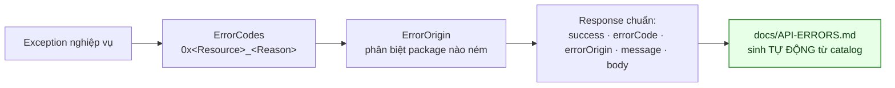
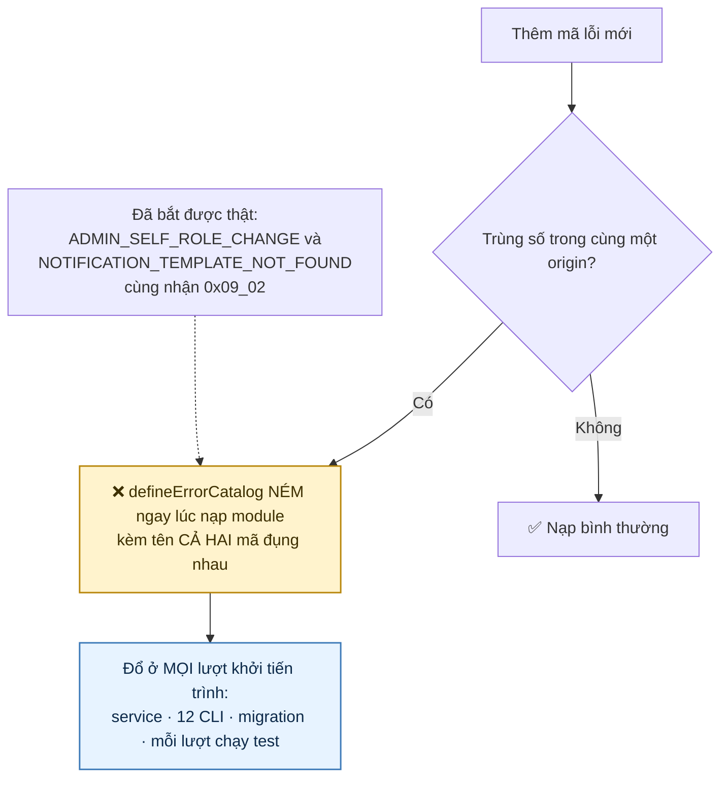
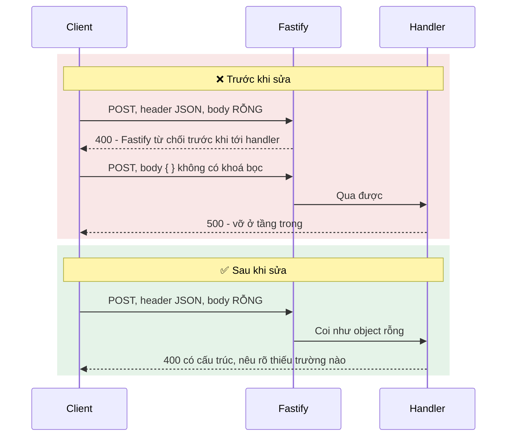
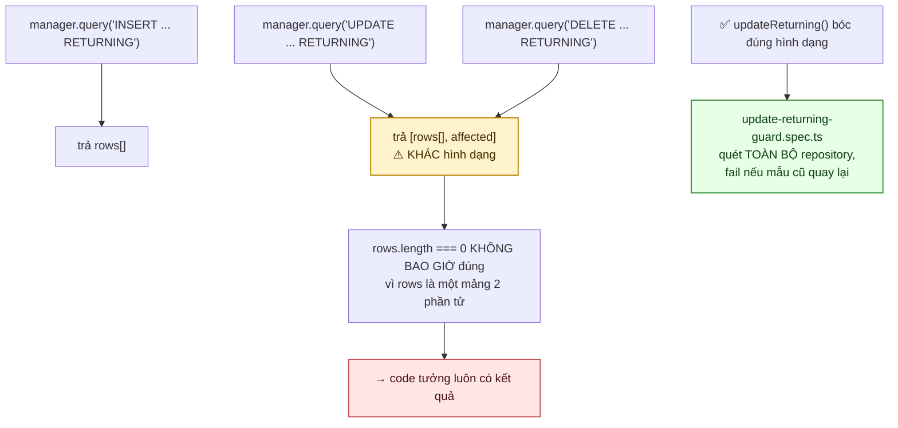
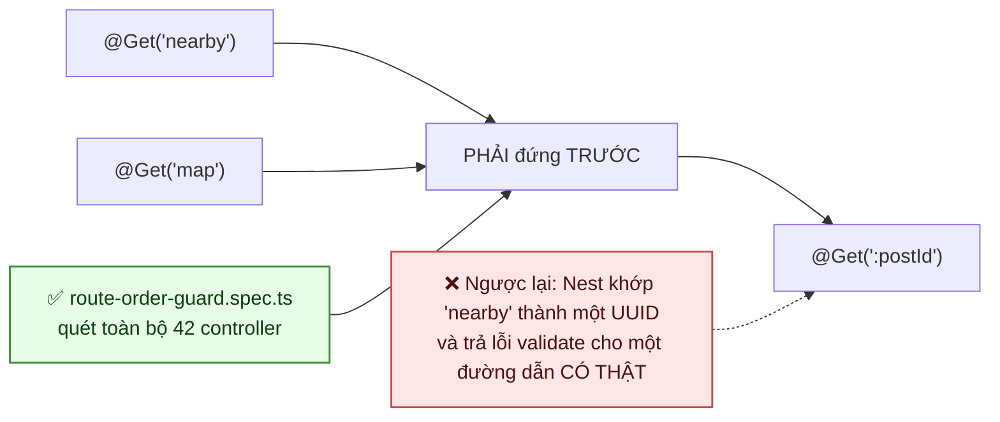
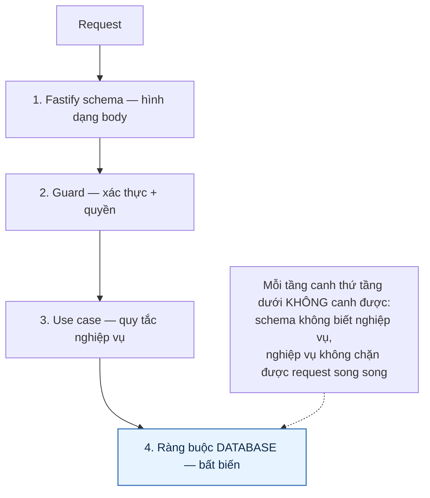

# 26 · Quy ước API & xử lý lỗi

Trạng thái: ✅ **đã hiện thực**, gồm hai cái bẫy đã sửa và có test canh.

## 26.1 Hình dạng một lỗi



Mọi response — thành công hay lỗi — đều **đúng năm khoá đó**, không hơn. `message` luôn là
một **mảng** chuỗi; `body` là `null` khi lỗi.

> Sơ đồ trước 01/10 vẽ `code · message · origin · details`. Ba tên đầu viết tắt sai (`code`
> thật ra là `errorCode`), và **`details` không tồn tại** — nó không có ở đâu trong
> `common-lib`. Một client viết theo sơ đồ đó sẽ đọc `undefined`. Đo thẳng:
>
> ```
> GET /api/v1/posts/khong-phai-uuid
> → khoá: ['body', 'errorCode', 'errorOrigin', 'message', 'success']
> ```

### Bản đồ nhóm mã

**Không ghi tổng số ở đây** — cùng bài học với số bảng ở [27](./27-database.md) và số route ở
[30](./30-endpoint-matrix.md). Con số "66 mã, 9 nhóm" ở bản trước đã lạc hậu: riêng `core-lib`
hiện có **14** nhóm, và `docs/API-ERRORS.md` — bản sinh tự động — tự in ra tổng trên cả ba tầng.

Trớ trêu là đoạn ghi chú ngay dưới đây vốn đã nói đúng lý do: *"viết tay thì nó lạc hậu ngay
lần thêm mã thứ hai"*. Bảng ở trên nó thì viết tay.

| Nhóm | Phạm vi |
| --- | --- |
| `0x01` | Bài đăng cho tặng (lớp tương thích) |
| `0x02` | Yêu cầu xin đồ |
| `0x03` | Người dùng |
| `0x04` | Phiên đăng nhập, OTP, đặt lại mật khẩu |
| `0x05` | Danh mục |
| `0x06` | Canonical bài đăng M2 |
| `0x07` | Point / Rank / Referral M4 |
| `0x08` | Giao dịch tặng/nhận M3 |
| `0x09` | Quản trị RBAC |
| `0x0A` | Chính sách quyền/quota theo rank |
| `0x0B` | Chat và thông báo |
| `0x0E` | Tương tác bảng tin |
| `0x0F` | Báo cáo vi phạm |
| `0x10` | Group, Sub-team và Affiliate (M5) |

Lấy danh sách thật và tổng số:

```bash
npm run docs:errors        # sinh lại docs/API-ERRORS.md, có in tổng
npm run docs:errors:check   # CI dùng cái này để bắt tài liệu lạc hậu
```

> **Vì sao tài liệu lỗi sinh tự động.** Viết tay thì nó lạc hậu ngay lần thêm mã thứ hai, và
> không ai phát hiện cho tới khi một client bắt nhầm mã.
>
> **Vì sao trùng số với package khác là bình thường.** `ErrorOrigin` mới là thứ phân biệt.
> Bắt mọi package trong monorepo phải đánh số toàn cục là tạo một sổ đăng ký mà ai cũng phải
> hỏi trước khi thêm một mã.
>
> Dãy `0x0C`/`0x0D` bỏ trống là bình thường: nhóm được cấp theo phân hệ, không cấp liên tiếp.

## 26.2 Trùng mã bị chặn ngay lúc NẠP MODULE



> **Sơ đồ trước 01/10 ghi "Migration TỪ CHỐI chạy" — sai cơ chế.** Việc chặn nằm ở
> `defineErrorCatalog`, chạy khi **module được nạp**, nên nó đổ ở mọi lượt khởi tiến trình và ở
> **mọi lượt chạy test** — không riêng migration. Tôi đoán cái 0x09_02 kia được *phát hiện*
> trong một lượt chạy migration, và cơ chế bị ghi theo triệu chứng.
>
> Khác biệt này có hậu quả thật: hiểu là "migration chặn" thì người ta tin có thể thêm mã trùng
> rồi sửa sau khi nào chạy migration. Thực tế `npm test` đỏ ngay.
>
> Phép kiểm chỉ xét **trong cùng một `origin`**. Trùng số giữa `chantam/core` và
> `system/auth-lib` là bình thường và có chủ đích — xem §26.1.

## 26.3 Bẫy 1 — body rỗng với `Content-Type: application/json`



> Hai lỗi khác nhau: một cái Fastify chặn trước khi code chạy, một cái lọt vào rồi vỡ ở tầng
> trong thành 500. Cả hai đều trả về thứ client không hành động được. Đã sửa, có test canh.

## 26.4 Bẫy 2 — `UPDATE ... RETURNING` bị TypeORM bọc



Kiểm trên database thật: `npm run test:returning`.

## 26.5 Thứ tự khai route — nay có phép kiểm canh



> **Vì sao quy ước này cần một phép kiểm cơ học, thêm 01/10.** Nó hỏng im lặng ở **cả** tầng
> biên dịch **và** tầng unit test: hai route đều tồn tại, hai handler đều có test riêng xanh.
> Chỉ một lượt gọi HTTP đúng đường dẫn đó mới phát hiện — tức chỉ smoke test, và chỉ nếu smoke
> có chạm đúng route ấy.
>
> Hai cái bẫy cùng loại đã có phép kiểm từ trước (`body-wrapper-guard.spec.ts`,
> `update-returning-guard.spec.ts`); đây là cái thứ ba. Lúc thêm, cả 42 controller đều **đúng**
> — nên nó chốt lại một trạng thái sạch chứ không mở ra một đợt dọn.
>
> **Hai chỗ phép kiểm này phải cẩn thận, và cả hai đều từng làm nó sai:**
>
> - **Bỏ comment trước khi quét.** `admin-report.controller.ts` có comment *"Đặt TRƯỚC
>   `@Get(':reportId')`…"* nằm ngay **trên** `@Get('reporters')`. Bản đầu đọc cả comment nên
>   báo oan đúng cái file đã làm đúng.
> - **So khớp từng đoạn, không chỉ đếm số đoạn.** `:id/review` KHÔNG nuốt `me/summary` vì đoạn
>   thứ hai khác nhau mà cả hai đều tĩnh. Kỳ vọng đầu của chính phép kiểm đã sai ở đây.
>
> Cả hai đều dẫn tới cùng một kết cục: một phép kiểm hay báo oan thì lần thứ hai nó đỏ, người
> ta sẽ tắt nó. Đó là lý do hai ca đó nay có test riêng.

## 26.6 Phân tầng kiểm



## Chỗ cần soát

1. ✅ **Đã có 30/09** — `GlobalRateLimitGuard`, đăng ký bằng `APP_GUARD` nên áp cho MỌI route,
   kể cả route thêm sau này. Trần theo IP mỗi phút, mặc định 600 (10 lượt/giây), đặt qua
   `GLOBAL_RATE_LIMIT_PER_MINUTE`.

   Hai lớp không trùng việc: lớp này chặn lụt thô từ một nguồn; `IRequestThrottle` ở từng chỗ gọi
   chặn lạm dụng một HÀNH VI ở mức thấp hơn nhiều (5 lượt đăng ký/giờ so với 600 request/phút).
   Vấn đề của lớp kia là nó phải được gọi ở từng chỗ, nên một endpoint mới quên gọi thì không có
   gì đỡ — đó là lý do lớp chung tồn tại.

   ⚠️ **Cái bẫy phải đặt đúng lúc triển khai: `TRUST_PROXY`.** Đứng sau nginx hay Cloudflare mà
   để `false` thì `request.ip` là IP của PROXY, nên mọi người dùng chung một bucket — trần chung
   sẽ đánh sập cả API ngay khi tổng lưu lượng vượt ngưỡng, và lớp bảo vệ trở thành lỗ tự gây.
   Ngược lại, bật khi KHÔNG có proxy thì ai cũng tự khai `X-Forwarded-For` được và trần thành vô
   nghĩa. Nó là env riêng, mặc định `false`, truyền vào `FastifyAdapter` lúc dựng — Fastify tự
   phân giải `request.ip`, không tự đọc header ở guard.

   `/health` **KHÔNG** bị áp trần: healthcheck hạ tầng gọi liên tục, và một `/health` bị 429 làm
   cổng kiểm tra sau triển khai chớp tắt vô cớ — rồi người ta sẽ tắt cổng đó đi. WebSocket cũng
   không, vì một tin nhắn chat không nên tiêu hạn mức của một lượt gọi API.

   Redis chết thì **cho qua**, giữ nguyên tinh thần `IRequestThrottle`: chặn toàn bộ người dùng
   chỉ vì Redis hỏng là đánh đổi tệ hơn hẳn.
2. **Chưa có request id / trace id** xuyên suốt để nối log với một request cụ thể. Mọi lượt điều tra
   sự cố vì thế phải đoán dòng log nào thuộc request nào — và dưới tải thật thì chúng xen nhau.
   Xem [31](./31-open-items.md) mục L13.
3. Thông báo lỗi hiện **chỉ có tiếng Việt**, chưa có cơ chế đa ngữ.
4. **Chưa có versioning API** ngoài tiền tố `/api/v1` — chưa có kế hoạch cho v2.

5. ✅ **Thêm 01/10** — `route-order-guard.spec.ts` canh quy ước §26.5. Xem ghi chú ở đó về hai
   chỗ phép kiểm phải cẩn thận, vì cả hai đã từng làm nó báo oan.

6. ⚠️ **Ba con số đếm tay đã lạc hậu, sửa 01/10.** `§26.1` ghi "66 mã lỗi, 9 nhóm";
   `docs/API.md` ghi "127 endpoint"; `[30](./30-endpoint-matrix.md)` vừa nói "không ghi tổng số
   nữa" vừa ghi "154 route" ngay câu sau. Thực tế lúc đo: `core-lib` có **14** nhóm mã, và
   OpenAPI có **157** operation trên **132** path.

   Cả ba nay trỏ sang cách ĐẾM thay vì ghi số — cùng bài học mà [27](./27-database.md) đã
   học với số bảng. Một con số đếm tay luôn chậm hơn commit mới nhất, và khó hơn: nó
   **trông như một sự thật đã được kiểm**.
