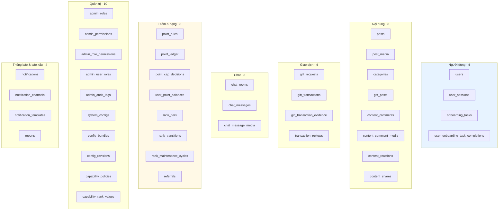
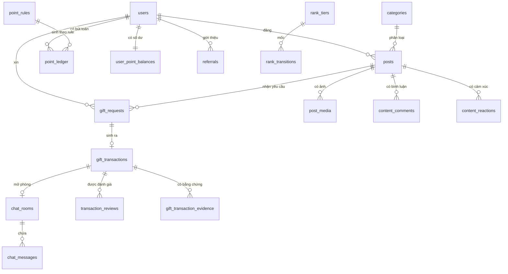
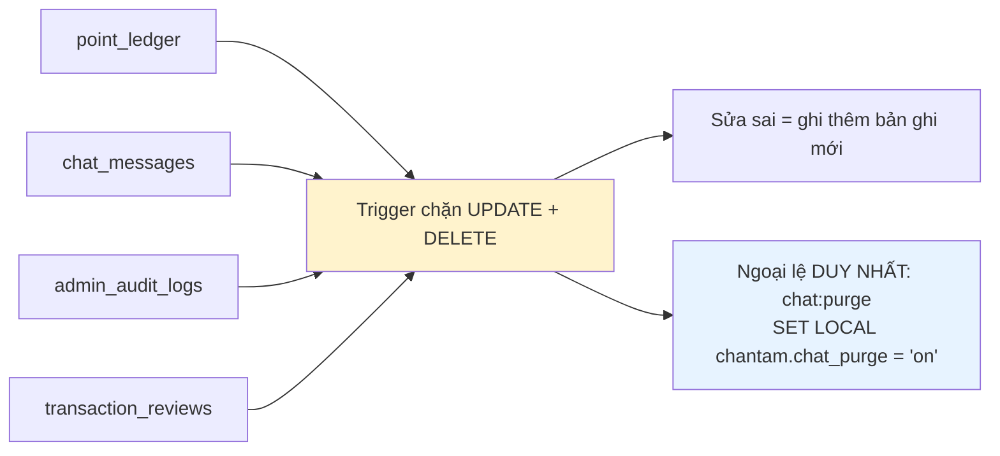
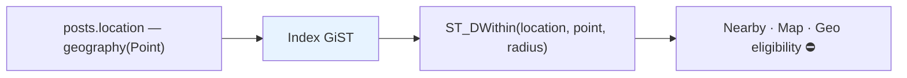

# 27 · Lược đồ database

Trạng thái: ✅ **44 bảng đang chạy** (đã trừ `content_reports` và `post_likes` bị drop khi gộp).

> ⚠️ `docs/DATABASE.md` còn ghi **28 bảng** — con số đó đã lạc hậu.

## 27.1 Nhóm bảng

## 27.2 Quan hệ lõi

## 27.3 Bảng append-only

> **Vì sao chặn ở trigger chứ không ở tầng ứng dụng.** Tầng ứng dụng có thể bị bỏ qua bởi một
> script chạy tay, một migration viết vội, hay một người vào psql. Trigger thì không.

## 27.4 Các ràng buộc giữ bất biến nghiệp vụ

| Ràng buộc | Giữ điều gì |
| --- | --- |
| `CHK_gift_transactions_not_self` | `giver_id <> receiver_id` — chặn tự tặng mình để farm điểm |
| `CHK_gift_transactions_completed_at` | `COMPLETED` bắt buộc có mốc hoàn tất |
| `CHK_point_ledger_balance_is_clamped_raw` | `balance_after = GREATEST(0, raw_balance_after)` |
| `CHK_posts_ship_payer_needs_shipping` | Tự đến lấy thì không khai được bên trả ship |
| `UQ_notifications_idempotency_key` | Một sự kiện chỉ ra một thông báo |
| `UQ_reports_open_reporter_target` | Mỗi người một báo xấu đang mở cho mỗi đích |
| `UQ_point_ledger_idempotency_key` | Chạy lại không cộng điểm lần hai |

> Đây là tầng phòng thủ cuối. Kiểm ở tầng ứng dụng rồi mới ghi thì hai request song song lọt
> qua được cả hai; ràng buộc database không có kẽ đó.

## 27.5 Index cho truy vấn địa lý

## Chỗ cần soát

1. ⚠️ **`docs/DATABASE.md` nói 28 bảng, thực tế 44** — tài liệu cần cập nhật.
2. `gift_posts` và `posts` **cùng tồn tại** vì lớp tương thích. Cần chốt bao giờ gỡ bảng cũ.
3. **Chưa có bảng nào cho Group/Affiliate** — khối lớn nhất còn lại.
4. **Chưa có `users.last_login_at`** dù đã chốt ngày 2026-09-24.
5. **Chưa có chiến lược lưu trữ dài hạn / phân vùng** cho `point_ledger` và `chat_messages`,
   hai bảng chỉ tăng không giảm.
6. **Backup có, nhưng restore test chưa từng chạy** — `DEFERRED.md` liệt nó là release blocker.
