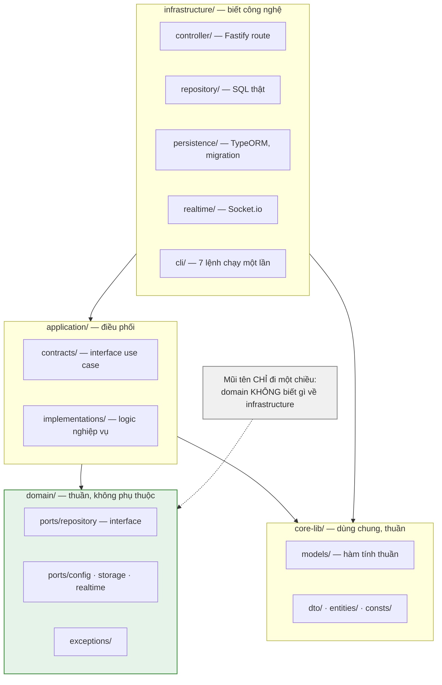
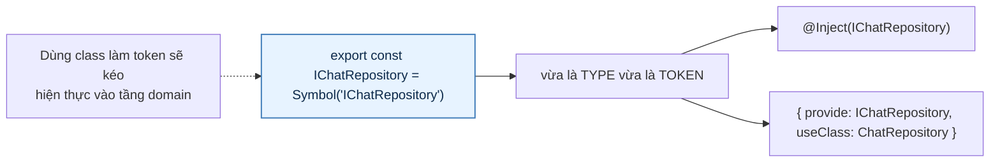
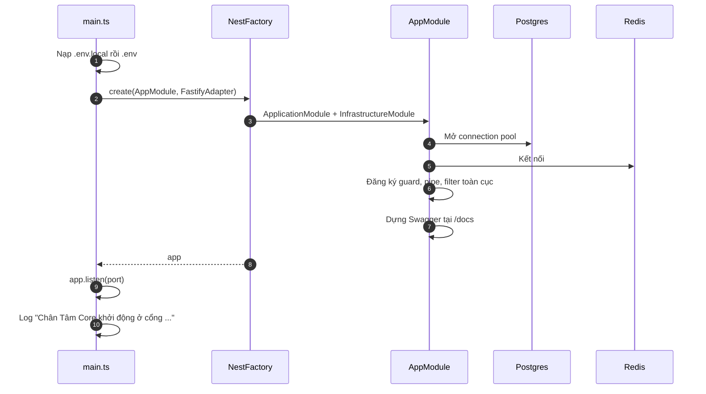
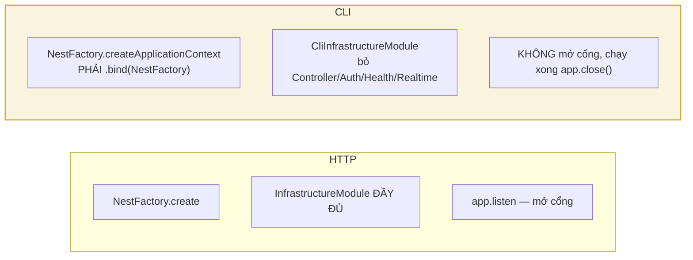
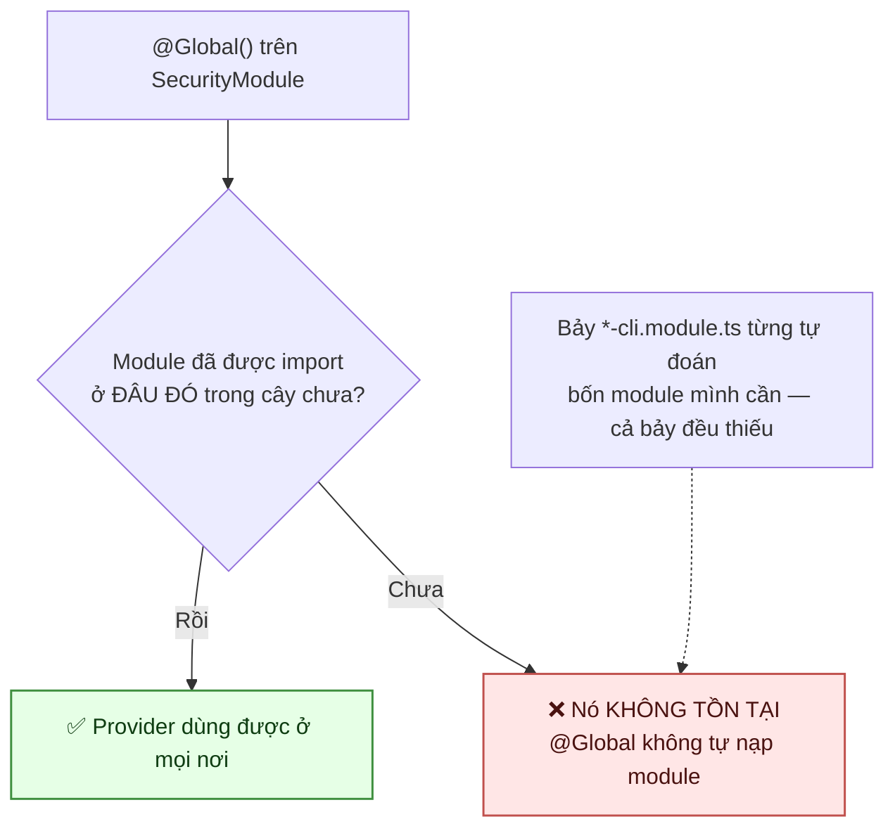
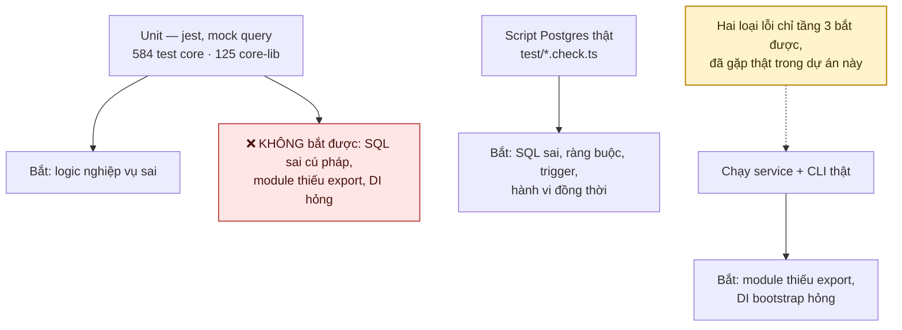

# 28 · Kiến trúc & khởi động

Trạng thái: ✅ **đã hiện thực**.

## 28.1 Bốn tầng

> **Vì sao model thuần nằm ở `core-lib`.** `computeGiverAccuracy`,
> `normalizeGiverAccuracyConfig`, `renderNotificationTemplate` là hàm không đụng database,
> không đụng thời gian, không đụng mạng — nên test được bằng bảng đầu vào/đầu ra, không cần
> dựng gì.

## 28.2 Tiêm phụ thuộc bằng `Symbol`

## 28.3 Khởi động HTTP

## 28.4 Khởi động CLI — khác ở hai chỗ

Chi tiết hai cái bẫy: [17-jobs](./17-jobs.md).

## 28.5 `@Global()` — cái bẫy đã làm cả bảy CLI chết

## 28.6 Kiểm thử — ba tầng, mỗi tầng bắt loại lỗi khác nhau

| Lệnh | Kiểm gì |
| --- | --- |
| `npm test` | Unit, 118 suite |
| `npm run test:returning` | Hợp đồng `UPDATE ... RETURNING` |
| `npm run test:reviews` | Đánh giá + accuracy + reconcile |
| `npm run test:feed-merge` | Gộp thích, hai cột đếm |
| `npm run test:lifecycle` | Vòng đời bài đăng |
| `npm run test:concurrency` | Hành vi khi request song song |
| `npm run test:chat-e2e` | Chat trên service thật |

## Chỗ cần soát

1. ✅ **Đã có** — `scripts/smoke-cli.sh` chạy thật cả 12 CLI trong job `integration`. Nó bắt
   được `post:expire` chết vì `PostModule` thiếu `GiftRequestModule` ngay lượt đầu, tức bài quá
   hạn không được đóng suốt từ lúc `CloseOpenRequestsService` ra đời.

   Bản đầu của script này còn **che mất chính lỗi đó**: nó tha exit code 1 cho mọi CLI, nên
   `post:expire` chết lúc khởi động mà vẫn hiện xanh. Nay chỉ một allowlist `SIGNAL_CLIS` được
   phép thoát khác 0, kèm lý do từng cái.
2. ⚠️ **Có, nhưng chỉ phần ĐỌC.** `deploy.yaml` chạy `smoke-test.sh --read-only` sau khi
   triển khai. Nó bắt được service không lên và endpoint đọc hỏng, nhưng **không** chạy CLI nào —
   nên đúng loại lỗi DI đã làm bảy CLI chết vẫn đi qua được cổng này. Chạy `smoke-cli.sh` ở đó
   là việc chưa làm; xem [29](./29-cicd.md) mục 4.
3. ✅ **Đã nằm trong pipeline 30/09.** Trước đó chỉ 5 trong 30 script chạy trong CI; nay cả 30.
   Lượt đầu bắt ngay hai lỗi, và cả hai do migration `1795700000000` seed thêm khoá cấu hình:
   một script nổ ràng buộc duy nhất, một script **hỏng lặng lẽ** vì `ON CONFLICT DO NOTHING`
   khiến lượt đặt cấu hình bị bỏ qua — nó xanh trong khi đo một thứ nó tưởng đã đặt.

   Bài học đã đóng thành hàng rào: `test/publish-config-version.ts` là chỗ DUY NHẤT script kiểm
   chứng được xuất bản một phiên bản cấu hình, và nó trả về số phiên bản để nơi gọi khẳng định
   được là mình thật sự ghi được.
4. Chưa có đo phủ bắt buộc (kiểm lại 30/09): `test:cov` có script nhưng không có
   `coverageThreshold` nào, và CI không chạy nó. Một con số phủ không ai canh thì chỉ là con số.

   Đáng nói là phủ KHÔNG phải thứ thiếu nhất ở đây: 910 unit test từng xanh trong lúc `post:expire`
   chết ba tháng và hai script kiểm chứng đo sai đối tượng. Thứ bắt được chúng là chạy thật trên
   Postgres và tiến trình thật — nay cả 30 script đó đã nằm trong CI.
