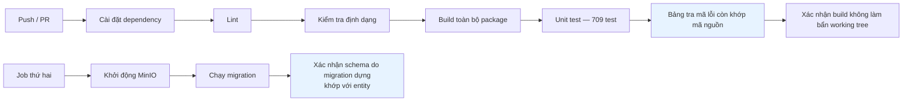
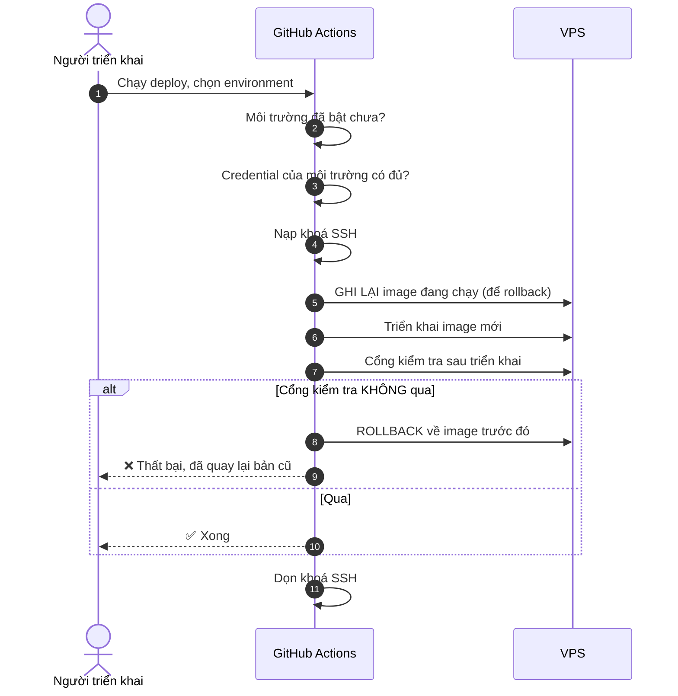
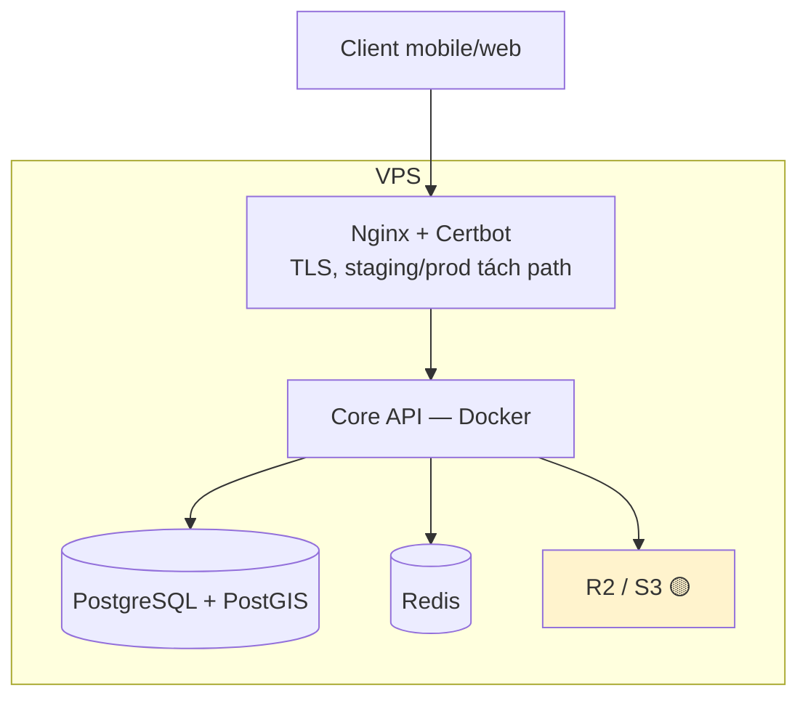
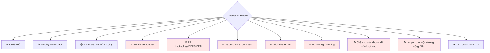

# 29 · CI/CD & triển khai

Trạng thái: ✅ **pipeline đã chạy**. 🟡 Một số điều kiện production chưa đủ.

## 29.1 Pipeline CI

> **Vì sao có bước "build không làm bẩn working tree".** Nếu build sinh ra file mà không ai
> commit, thì máy CI và máy lập trình viên đang chạy hai thứ khác nhau — và không ai biết.
>
> **Vì sao xác nhận schema khớp entity.** Sửa entity mà quên viết migration là lỗi im lặng:
> local chạy được vì `synchronize` đã dựng cột, production thì không có cột đó.

## 29.2 Triển khai

> **Vì sao ghi lại image cũ TRƯỚC khi triển khai.** Ghi sau thì khi bản mới hỏng, không còn
> chỗ nào biết bản cũ là cái nào. Rollback phải là một đường đã dựng sẵn, không phải thứ đi
> tìm lúc đang cháy.

## 29.3 Hạ tầng

## 29.4 Bốn workflow

| Workflow | Làm gì |
| --- | --- |
| `ci.yaml` | Lint, format, build, test, migration, schema drift |
| `deploy.yaml` | Triển khai có cổng kiểm tra và rollback |
| `release.yaml` | Đóng gói bản phát hành |
| `codeql.yaml` | Quét bảo mật mã nguồn |
| `security-audit.yaml` | Quét lỗ hổng dependency |

## 29.5 Điều kiện trước khi gọi production-ready

> **`backup` không có `restore test` thì không phải backup**, nó chỉ là một thư mục file nén
> mà chưa ai chứng minh được là mở ra dùng lại được.

## Chỗ cần soát

1. ✅ **Lịch cron đã có** — [`deploy/cron/`](../../deploy/cron/README.md). ⛔ Nhưng alert chưa nối vào kênh người thật đọc.
2. ⛔ **Chưa có monitoring/alerting.** Service chết lúc 2 giờ sáng thì sáng ra mới biết.
3. ⛔ **Restore test chưa từng chạy.**
4. **Cổng kiểm tra sau triển khai kiểm gì?** Cần soát xem nó có đủ sâu để bắt được lỗi DI
   kiểu đã làm cả bảy CLI chết hay không.
5. **Chưa có smoke test chạy CLI** trong pipeline.
