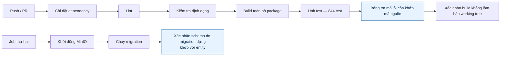
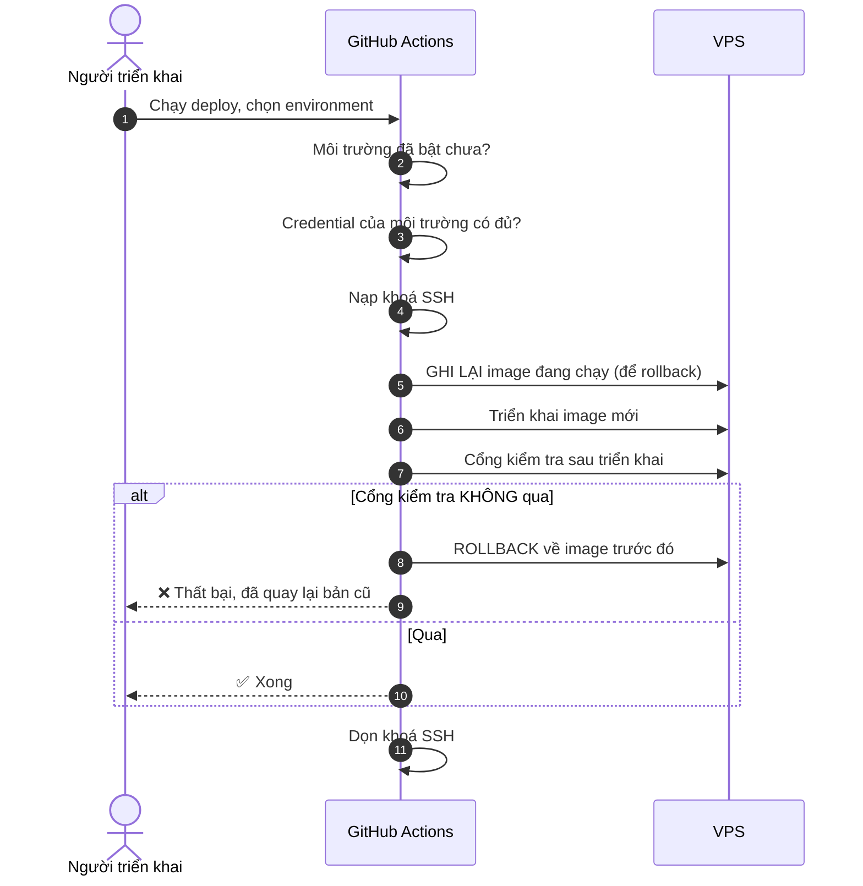
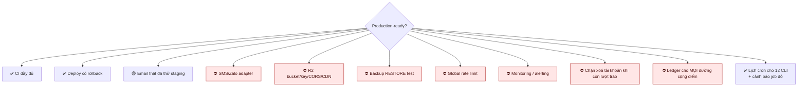

# 29 · CI/CD & triển khai

Trạng thái: ✅ **pipeline đã chạy**. 🟡 Một số điều kiện production chưa đủ.

## 29.1 Pipeline CI

> **Vì sao có bước "build không làm bẩn working tree".** Nếu build sinh ra file mà không ai
> commit, thì máy CI và máy lập trình viên đang chạy hai thứ khác nhau — và không ai biết.
>
> **Vì sao xác nhận schema khớp entity.** Sửa entity mà quên viết migration là lỗi im lặng:
> local chạy được vì `synchronize` đã dựng cột, production thì không có cột đó.

## 29.2 Triển khai

> **Vì sao ghi lại image cũ TRƯỚC khi triển khai.** Ghi sau thì khi bản mới hỏng, không còn
> chỗ nào biết bản cũ là cái nào. Rollback phải là một đường đã dựng sẵn, không phải thứ đi
> tìm lúc đang cháy.

## 29.3 Hạ tầng

## 29.4 Sáu workflow

| Workflow | Làm gì |
| --- | --- |
| `ci.yaml` | Lint, format, build, test, **typecheck script kiểm**, migration, schema drift |
| `deploy.yaml` | Triển khai có cổng kiểm tra và rollback |
| `release.yaml` | Đóng gói bản phát hành |
| `codeql.yaml` | Quét bảo mật mã nguồn |
| `security-audit.yaml` | Quét lỗ hổng dependency |
| `mirror-images.yaml` | Sao ảnh hạ tầng của bên thứ ba về GHCR của chính repo. **Chạy tay**, cố ý không theo lịch — mirror là để ĐÓNG BĂNG một bản đã kiểm, không phải để lặng lẽ kéo bản mới về |

> **Vì sao phải có workflow mirror.** Ngày 24/09 `quay.io/minio/minio` bị chuyển sang riêng
> tư: pull ẩn danh trả 401 cho MỌI tag **và cả digest**, `docker.io/minio/minio` thì bị xoá
> hẳn, và CI đỏ toàn bộ dù không ai sửa gì. Máy nào còn ảnh trong cache vẫn chạy, nên chỉ
> runner sạch mới lộ ra.
>
> **Ghim digest không cứu được chuyện đó** — khi cả kho bị khoá thì digest cũng 401. Thứ duy
> nhất cứu được là giữ một bản sao ở nơi mình kiểm soát. Từ 29/09 compose ghim
> `ghcr.io/fdshn/trueheart-minio`, package để Public nên runner sạch kéo được mà không cần
> đăng nhập.
>
> **Workflow kiểm ảnh TRƯỚC khi đẩy**: dựng container, tạo bucket, `mc ls`. Sao một ảnh hỏng
> về kho của mình thì chỉ đổi chỗ lỗi — đúng cái bẫy `quay.io/minio/aistor/minio` giăng ra,
> nơi container sống và healthcheck trả 200 nhưng mọi thao tác S3 báo thiếu license.

## 29.5 Điều kiện trước khi gọi production-ready

> **`backup` không có `restore test` thì không phải backup**, nó chỉ là một thư mục file nén
> mà chưa ai chứng minh được là mở ra dùng lại được.

## Chỗ cần soát

1. ✅ **Lịch cron và alert đều đã có** (30/09) — [`deploy/cron/`](../../deploy/cron/README.md).
   `send-alert.sh` POST tới `$CHANTAM_CRON_ALERT_URL`; chưa đặt URL thì ghi vào
   `alerts-chua-gui-duoc.log` và trả mã khác 0 thay vì im lặng. Nhịp tim hằng tuần để "không có
   cảnh báo" khác được với "đường cảnh báo đã chết". `scripts/test-cron-alert.sh` chạy trong CI.
2. ✅ **Đã có 30/09** — `deploy/cron/check-health.sh`, mỗi 5 phút, dùng đúng đường cảnh báo
   của `send-alert.sh`.

   Đây là healthcheck NGOÀI tiến trình: nó không phụ thuộc vào việc service còn sống để báo rằng
   service đã chết. Cần nó vì `run-cli.sh` chỉ báo khi một JOB đỏ, mà service chết thì không job
   nào đỏ — chúng chỉ không chạy được, và giữa hai lượt job là một khoảng nằm im không ai biết.

   Ba quyết định về NHỊP báo, mỗi cái vì một cách người ta bỏ qua cảnh báo:

   - **Chỉ báo sau 3 lượt thất bại liên tiếp.** Một lượt `curl` trượt vì mạng chớp hay vì
     container đang khởi động lại sau deploy — báo ngay là dạy người ta bỏ qua.
   - **Báo ĐÚNG một lần lúc chạm ngưỡng**, không lặp mỗi 5 phút. Một sự cố hai giờ sẽ gửi 24
     dòng giống nhau, và kênh sẽ bị tắt.
   - **Báo cả lúc hồi phục.** Thiếu nó thì người nhận không biết chuyện đã xong, và họ vào xem
     một sự cố đã tự khỏi — hoặc tệ hơn, tưởng nó vẫn đang xảy ra.

   `scripts/test-cron-alert.sh` canh cả bốn hành vi đó.
3. ⛔ **Restore test chưa từng chạy.**
4. ✅ **Đã đủ sâu 30/09.** Cổng nay có hai phần: `smoke-test.sh --read-only` qua HTTP, và tự
   kiểm cây DI của cả 12 CLI trên host qua SSH.

   Chốt cách chạy: **qua SSH trên host**, không ở runner — mã sống trong container ở đó, và
   `docker compose exec` cần chính máy đó. Script đẩy qua stdin nên không cần checkout trên host;
   deploy đẩy image chứ không đẩy source, nên một checkout cũ sẽ kiểm bằng danh sách CLI lỗi thời.

   Và **không chạy CLI ở chế độ thường** — xem [28](./28-architecture.md) mục 2 để biết vì sao.
5. ✅ **Đã có ở cả hai chỗ 30/09.** CI chạy `smoke-cli.sh` ở chế độ thường (database throwaway
   nên chạy thật được); `deploy.yaml` chạy nó với `CHANTAM_CLI_SELF_CHECK=1` trên host qua SSH,
   dùng `CHANTAM_CLI_RUNNER='docker compose exec -T core node'` vì mã chạy trong container.

   Một script, hai chế độ, một danh sách CLI — quan trọng vì hai danh sách sẽ trôi khỏi nhau, và
   `smoke-cli.sh` còn có phép kiểm "không CLI nào bị bỏ ngoài danh sách" để thêm CLI mới mà quên
   khai thì đỏ.
