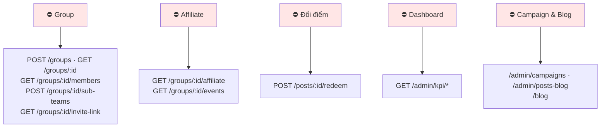

# 30 · Ma trận endpoint × quyền × trạng thái

Bảng tra nhanh: mỗi endpoint cần gì, và nó đã chạy được chưa. 62 endpoint đang có.

## 30.1 Ba mức truy cập

## 30.2 Xác thực & hồ sơ

| Endpoint | Truy cập | Trạng thái |
| --- | --- | --- |
| `POST /auth/register` | công khai | ✅ |
| `POST /auth/login` | công khai | ✅ |
| `POST /auth/refresh` | công khai | ✅ |
| `POST /auth/logout` | token | ✅ |
| `POST /auth/password-reset/request` | công khai | ✅ 🟡 email |
| `POST /auth/password-reset/confirm` | công khai | ✅ |
| `DELETE /auth/account` | token | ⚠️ chưa chặn lượt trao dở dang |
| `GET /auth/me` | token | ✅ |
| `GET /profile/me` · `PATCH /profile/me` | token | ✅ |
| `PATCH /profile/me/avatar-upload` | token | ✅ |
| `PATCH /profile/me/phone-verification/request` · `/confirm` | token | 🟡 chưa có adapter SMS |
| `GET /profile/:username` | token | ✅ |
| `GET /onboarding/tasks` · `/evaluate` · `/:key/trigger` | token | ✅ |
| `GET /me/entitlements` | token | ✅ |
| `GET /referrals/me` | token | ✅ |

## 30.3 Bài đăng & khám phá

| Endpoint | Truy cập | Trạng thái |
| --- | --- | --- |
| `POST /posts` | token + quota rank | ✅ |
| `GET /posts/nearby` · `/map` · `/me` | token | ✅ |
| `GET /posts/:postId` | token | ✅ jitter toạ độ |
| `PATCH /posts/:postId` · `DELETE` | chủ bài | ✅ |
| `POST /posts/:postId/renew` | chủ bài | ✅ 1 lần |
| `POST /posts/:postId/media/upload` · `/media` · `/media/order` · `DELETE /media/:id` | chủ bài | ✅ |
| `GET /posts/:postId/matches` | token | ✅ |
| `POST /posts/:postId/charity-transfer` · `PATCH` | chủ bài / Admin | ✅ |
| `POST /posts/:postId/like` | token | ✅ lối tắt sang `content_reactions` |
| `POST|GET|PATCH|DELETE /gift-posts/*` | token | ✅ lớp tương thích |
| `GET /discovery/config` | công khai | ✅ |
| `GET /categories` | công khai | ✅ |
| `POST /categories` · `PATCH /categories/:id` | `category.manage` | ✅ |

## 30.4 Tương tác

| Endpoint | Truy cập | Trạng thái |
| --- | --- | --- |
| `POST /posts/:id/comments` · `GET` | token | ✅ |
| `GET /comments/:id/replies` | token | ✅ |
| `PATCH` · `DELETE /comments/:id` | tác giả | ✅ |
| `POST /posts/:id/comment-media/upload-url` | token | ✅ |
| `PUT` · `DELETE /posts/:id/reactions/me` | token | ✅ |
| `GET /posts/:id/reactions` | token | ✅ |
| `PUT` · `DELETE /comments/:id/reactions/me` | token | ✅ |
| `POST /posts/:id/shares` | token | ✅ |

## 30.5 Giao dịch & chat

| Endpoint | Truy cập | Trạng thái |
| --- | --- | --- |
| `POST /posts/:id/requests` · `/withdraw` | token | ⚠️ chưa gắn cổng F07 |
| `GET /posts/:id/requests` | chủ bài | ✅ |
| `POST /posts/:id/requests/:requestId/accept` | chủ bài | ✅ |
| `POST /transactions` · `/accept` | bên liên quan | ✅ |
| `POST /transactions/:id/evidence/upload-url` | bên liên quan | ✅ |
| `POST /transactions/:id/handover` | người tặng | ✅ |
| `POST /transactions/:id/confirm` | người nhận | ⛔ chưa cộng điểm |
| `POST /transactions/:id/cancel` | bên liên quan | ✅ |
| `POST /transactions/:id/reports/ship-unpaid` | **chỉ người gửi** | ✅ |
| `GET /transactions/me` | token | ✅ |
| `POST` · `GET /transactions/:id/reviews` | bên liên quan | ✅ |
| `GET /chat/rooms` · `/messages` · `POST /messages` | thành viên phòng | ⚠️ chưa gắn cổng F07 |
| `POST /chat/rooms/:id/message-media/upload-url` | thành viên phòng | ✅ |
| `PATCH /chat/rooms/:id/read` | thành viên phòng | ✅ |
| `GET /notifications/me` · `PATCH /read` | token | ✅ |

## 30.6 Điểm, hạng, báo xấu

| Endpoint | Truy cập | Trạng thái |
| --- | --- | --- |
| `GET /points/me` · `/ledger` | token | ⚠️ chưa phản ánh mô hình rank mới |
| `GET /ranks/me` | token | ⚠️ đọc `lifetime` |
| `POST /ranks/maintenance/evaluate` | `rank.operate` | ✅ |
| `POST /reports` | token | ✅ POST/USER/COMMENT |

## 30.7 Admin

| Endpoint | Quyền | Trạng thái |
| --- | --- | --- |
| `GET` · `POST /admin/system-configs` | `config.read` / `config.write` | ✅ |
| `GET` · `PUT /admin/candidate-selection` | `config.*` | ✅ |
| `GET /admin/audit-logs` | `audit.read` | ✅ |
| `GET /admin/system-logs` | `audit.read` | ✅ |
| `GET /admin/me` · `/roles` | token | ✅ |
| `POST` · `DELETE /admin/users/:id/roles` | `admin.manage` | ✅ |
| `GET /admin/users` · `/:id` | `admin.manage` | ✅ |
| `PATCH /admin/users/:id/status` · `DELETE` | `admin.manage` | ✅ |
| `GET` · `POST /admin/points/rules` | `config.*` | ✅ |
| `POST /admin/points/ledger/:id/reversal` | `point.adjust` | ✅ |
| `GET` · `POST /admin/ranks/policy` · `/maintenance` | `rank.operate` | ✅ |
| `GET` · `POST /admin/entitlements` | `entitlement.*` | ✅ |
| `GET` · `PUT /admin/notification-channels/:channel` | `notification.manage` | ✅ |
| `GET` · `PUT /admin/notification-templates/:type` | `notification.manage` | ✅ |
| `GET /admin/posts` · `/:id` | `post.read` | ✅ |
| `PATCH /admin/posts/:id/moderation` | `post.moderate` | ✅ |
| `GET /admin/reports` · `/:id` | `report.read` | ✅ |
| `PATCH /admin/reports/:id/review` | `report.resolve` | ✅ |
| `GET /admin/categories` | `category.read` | ✅ |

## 30.8 Endpoint CHƯA có

## Chỗ cần soát

1. **Ba endpoint cần gắn cổng hồ sơ F07** (xin nhận, chat, và tạo Group khi có).
2. **`POST /transactions/:id/confirm` chưa cộng điểm** — lỗ hổng lớn nhất.
3. **`GET /points/me` và `/ranks/me` chưa phản ánh mô hình rank chốt 2026-09-24.**
4. `POST /reports` nhận `COMMENT` nhưng **`targetLabel` cho bình luận** cần soát xem Admin có
   đủ thông tin để quyết mà không phải mở từng cái không.
