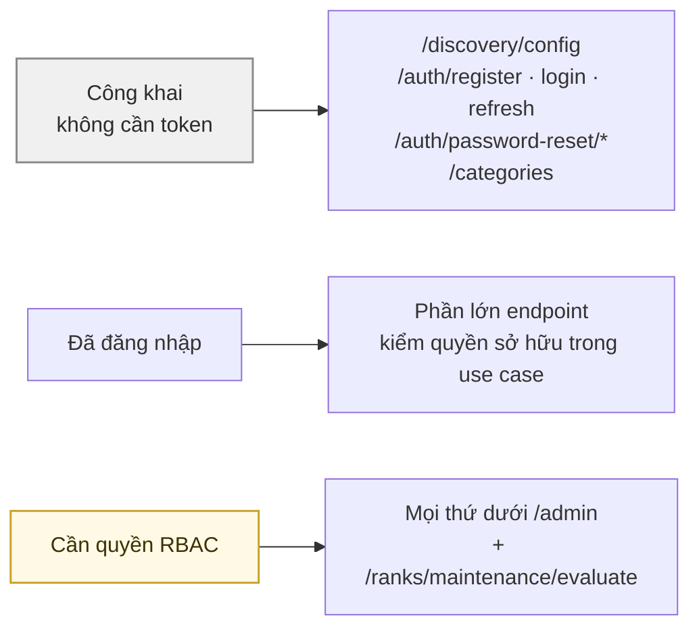
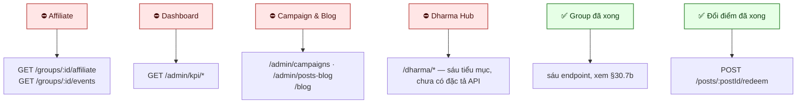

# 30 · Ma trận endpoint × quyền × trạng thái

Bảng tra nhanh: mỗi endpoint cần gì, và nó đã chạy được chưa.

> **Không ghi tổng số endpoint ở đây nữa** (30/09). Con số "62" đã lạc hậu, và bản sửa nó ghi "154" cũng lạc hậu nốt — chính câu này
> từng vừa nói "không ghi tổng số" vừa ghi một tổng số (sửa 01/10). Cùng bài học với số bảng ở [27](./27-database.md): một con số đếm tay thì
> luôn chậm hơn commit mới nhất. Lấy danh sách thật từ `GET /docs/json`, hoặc:
>
> ```bash
> grep -rhoE '@(Get|Post|Put|Patch|Delete)\(' \
>   suites/chantam.vn/chantam/core/src/infrastructure/controller/api --include=*.ts | wc -l
> ```

## 30.1 Ba mức truy cập



## 30.2 Xác thực & hồ sơ

| Endpoint | Truy cập | Trạng thái |
| --- | --- | --- |
| `POST /auth/register` | công khai | ✅ |
| `POST /auth/login` | công khai | ✅ |
| `POST /auth/refresh` | công khai | ✅ |
| `POST /auth/logout` | token | ✅ |
| `POST /auth/password-reset/request` | công khai | ✅ 🟡 email |
| `POST /auth/password-reset/confirm` | công khai | ✅ |
| `DELETE /auth/account` | token | ⚠️ chưa chặn lượt trao dở dang |
| `GET /auth/me` | token | ✅ |
| `GET /profile/me` · `PATCH /profile/me` | token | ✅ |
| `PATCH /profile/me/avatar-upload` | token | ✅ |
| `PATCH /profile/me/phone-verification/request` · `/confirm` | token | 🟡 chưa có adapter SMS |
| `GET /profile/:username` | token | ✅ |
| `GET /onboarding/tasks` · `/evaluate` · `/:key/trigger` | token | ✅ |
| `GET /me/entitlements` | token | ✅ |
| `GET /referrals/me` | token | ✅ |

## 30.3 Bài đăng & khám phá

| Endpoint | Truy cập | Trạng thái |
| --- | --- | --- |
| `POST /posts` | token + quota rank | ✅ |
| `GET /posts/nearby` · `/map` · `/me` | token | ✅ |
| `GET /posts/:postId` | token | ✅ jitter toạ độ — trừ chính tác giả, kèm `canEdit` |
| `PATCH /posts/:postId` | chủ bài | ✅ chặn khi có giao dịch `ACCEPTED`/`DELIVERING` |
| `DELETE /posts/:postId` | chủ bài | ✅ chặn khi bài `RESERVED`/`DELIVERING` |
| `POST /posts/:postId/renew` | chủ bài | ✅ 1 lần |
| `POST /posts/:postId/media/upload` · `/media` · `/media/order` · `DELETE /media/:id` | chủ bài | ✅ cùng khoá với `PATCH` |
| `GET /posts/:postId/matches` | token | ✅ |
| `GET /requests/me` | token | ✅ yêu cầu của chính người gọi |
| `GET /transactions/:id` | hai bên trong cuộc | ✅ người ngoài nhận 404 |
| `PATCH /admin/transactions/:id/reopen` | `admin.manage` | ✅ mở lại lượt đóng nhầm |
| `DELETE /chat/rooms/:id/messages/:id` | người gửi | ✅ thu hồi trong 5 phút |
| `PATCH /chat/rooms/:id/mute` | trong phòng | ✅ tắt chuông, không chặn tin |
| `GET` · `PATCH /notifications/me/preferences` | token | ✅ tắt/bật theo nhóm |
| `GET /admin/chat/rooms/:id/messages` | `report.read` | ✅ chỉ khi có báo xấu đang mở |
| `POST /posts/:id/requests/:requestId/reject` | chủ bài | ✅ chỉ PENDING/STANDBY |
| `POST /posts/:postId/charity-transfer` · `PATCH` | chủ bài / Admin | ✅ |
| `POST|GET|PATCH|DELETE /gift-posts/*` | token | ✅ lớp tương thích |
| `GET /discovery/config` | công khai | ✅ |
| `GET /categories` | công khai | ✅ |
| `POST /categories` · `PATCH /categories/:id` | `category.manage` | ✅ |

## 30.4 Tương tác

| Endpoint | Truy cập | Trạng thái |
| --- | --- | --- |
| `POST /posts/:id/comments` · `GET` | `COMMENT_CONTENT` | ✅ trần 10/phút + 200/24 giờ |
| `GET /comments/:id/replies` | token | ✅ |
| `PATCH` · `DELETE /comments/:id` | tác giả | ✅ |
| `POST /posts/:id/comment-media/upload-url` | token | ✅ |
| `PUT` · `DELETE /posts/:id/reactions/me` | `REACT_CONTENT` | ✅ nút thích; không trần, gửi trùng không ghi |
| `GET /posts/:id/reactions` | token | ✅ |
| `PUT` · `DELETE /comments/:id/reactions/me` | `REACT_CONTENT` | ✅ |
| `POST /posts/:id/shares` | token | ✅ chờ 1 giờ mỗi người mỗi bài |

## 30.5 Giao dịch & chat

| Endpoint | Truy cập | Trạng thái |
| --- | --- | --- |
| `POST /posts/:id/requests` · `/withdraw` | token | ⚠️ chưa gắn cổng F07 |
| `GET /posts/:id/requests` | chủ bài | ✅ |
| `POST /posts/:id/requests/:requestId/accept` | chủ bài | ✅ |
| `POST /transactions` · `/accept` | bên liên quan | ✅ |
| `POST /transactions/:id/evidence/upload-url` | bên liên quan | ✅ |
| `POST /transactions/:id/handover` | người tặng | ✅ |
| `POST /transactions/:id/confirm` | người nhận | ⛔ chưa cộng điểm |
| `POST /transactions/:id/cancel` | bên liên quan | ✅ |
| `POST /transactions/:id/reports/ship-unpaid` | **chỉ người gửi** | ✅ |
| `GET /transactions/me` | token | ✅ |
| `POST` · `GET /transactions/:id/reviews` | bên liên quan | ✅ |
| `GET /chat/rooms` · `/messages` · `POST /messages` | thành viên phòng | ⚠️ chưa gắn cổng F07 |
| `POST /chat/rooms/:id/message-media/upload-url` | thành viên phòng | ✅ |
| `PATCH /chat/rooms/:id/read` | thành viên phòng | ✅ |
| `GET /notifications/me` · `PATCH /read` | token | ✅ |

## 30.6 Điểm, hạng, báo xấu

| Endpoint | Truy cập | Trạng thái |
| --- | --- | --- |
| `GET /points/me` · `/ledger` | token | ⚠️ chưa phản ánh mô hình rank mới |
| `GET /ranks/me` | token | ⚠️ đọc `lifetime` |
| `POST /ranks/maintenance/evaluate` | `rank.operate` | ✅ |
| `POST /reports` | token | ✅ POST/USER/COMMENT |

## 30.7 Admin

| Endpoint | Quyền | Trạng thái |
| --- | --- | --- |
| `GET` · `POST /admin/system-configs` | `config.read` / `config.write` | ✅ |
| `GET` · `PUT /admin/candidate-selection` | `config.*` | ✅ |
| `GET /admin/audit-logs` | `audit.read` | ✅ |
| `GET /admin/system-logs` | `audit.read` | ✅ |
| `GET /admin/me` · `/roles` | token | ✅ |
| `POST` · `DELETE /admin/users/:id/roles` | `admin.manage` | ✅ |
| `GET /admin/users` · `/:id` | `admin.manage` | ✅ |
| `PATCH /admin/users/:id/status` · `DELETE` | `admin.manage` | ✅ |
| `GET` · `POST /admin/points/rules` | `config.*` | ✅ |
| `POST /admin/points/ledger/:id/reversal` | `point.adjust` | ✅ |
| `GET` · `POST /admin/ranks/policy` · `/maintenance` | `rank.operate` | ✅ |
| `GET` · `POST /admin/entitlements` | `entitlement.*` | ✅ |
| `GET` · `PUT /admin/notification-channels/:channel` | `notification.manage` | ✅ |
| `GET` · `PUT /admin/notification-templates/:type` | `notification.manage` | ✅ |
| `GET /admin/posts` · `/:id` | `post.read` | ✅ |
| `PATCH /admin/posts/:id/moderation` | `post.moderate` | ✅ |
| `GET /admin/comments/pending-count` | `post.moderate` | ✅ huy hiệu menu CMS |
| `GET /admin/comments` | `post.moderate` | ✅ hàng đợi bình luận chờ duyệt |
| `PATCH /admin/comments/:id/moderation` | `post.moderate` | ✅ |
| `GET /admin/reports` · `/:id` | `report.read` | ✅ |
| `PATCH /admin/reports/:id/review` | `report.resolve` | ✅ |
| `GET /admin/categories` | `category.read` | ✅ |

## 30.7b Nhóm — `/groups`

| Endpoint | Cổng | Có |
| --- | --- | --- |
| `POST /groups` | token + hồ sơ + onboarding + rank + có Default Location | ✅ |
| `GET /groups/me` | token | ✅ |
| `GET /groups/:groupId` | `group.overview.view` | ✅ |
| `PATCH /groups/:groupId` | `group.settings.manage` — chỉ Owner; KHÔNG sửa tâm/bán kính | ✅ |
| `GET /groups/:groupId/activities` | `group.activity.view` (cả nhóm) HOẶC `group.subteam.activity.view` (chỉ tổ mình) | ✅ |
| `GET /groups/:groupId/invite` | `group.invite.view` — chỉ Owner | ✅ |
| `GET /groups/:groupId/affiliate` | `group.affiliate.view` — chỉ Owner; trả ĐIỀU KIỆN, không phải điểm đã chia | ✅ |
| `GET /groups/:groupId/members` | `group.member.view` (cả nhóm) HOẶC `group.subteam.member.view` (chỉ tổ mình) | ✅ |
| `GET /groups/:groupId/sub-teams` | ⬆ cùng cặp quyền | ✅ |
| `POST /groups/:groupId/sub-teams` | `group.subteam.manage` — chỉ Owner | ✅ |
| `DELETE /groups/:groupId/sub-teams/:subTeamId` | ⬆ — người trong tổ Ở LẠI nhóm, trưởng tổ hạ về MEMBER | ✅ |
| `PATCH /groups/:groupId/members/:memberId` | `group.member.assign_role` — bỏ trống `subTeamId` là GIỮ tổ | ✅ |
| `GET\|PUT /admin/groups/role-permissions[/:role]` | `config.read` / `config.write` | ✅ |
| `GET\|PUT /admin/groups/radius-policy` | ⬆ — canh bất biến đơn điệu theo bậc | ✅ |
| `GET /admin/chat/flags` · `/pending-count` | `report.read` | ✅ |
| `PATCH /admin/chat/flags/:flagId/review` | `report.resolve` | ✅ |

Vào nhóm KHÔNG có endpoint riêng: `POST /auth/register` kèm `inviteCode` là đường duy nhất
(F54/BR-GRP-04). Rời nhóm và chuyển nhóm cũng không có, và đó là chủ ý (BR-GRP-06).

> **Quyền nhóm luôn mang phạm vi một nhóm.** Mọi dòng trên đi qua
> `hasGroupPermission(userId, groupId, permission)`, không phải `hasPermission` toàn cục — RBAC
> Admin không diễn đạt được "có quyền X trên nhóm nào", nên gán `group.member.assign_role` ở đó
> cho một trưởng nhóm là cho họ quyền trên **mọi** nhóm. Xem [18 §18.3](./18-group.md).
>
> Mười trên mười quyền nhóm nay đều có dòng code kiểm — `test:config-inventory` đỏ nếu ai seed
> thêm một mã mà không khai nó đọc ở đâu.

## 30.8 Còn thiếu gì



## Chỗ cần soát

1. **Ba endpoint cần gắn cổng hồ sơ F07** (xin nhận, chat, tạo Group) — cả ba đã gắn.
2. ✅ **Đã sửa 25/09.** Hoàn tất lượt trao sinh điểm qua đường đánh giá, hoặc qua
   `gift:settle-rewards` sau 7 ngày nếu người nhận không đánh giá — xem
   [21 §21.4](./21-open-issues.md) mục 1.
3. ✅ **Đã phản ánh.** Xét hạng đọc `balance` (hoặc `lifetime` nếu Admin đổi
   `rank.points_source`), và `test:rank-balance` canh đúng điều đó.
4. ✅ **Đã có `targetLabel` cho bình luận** (đợt 15-report): trích đoạn đầu `body` cùng tên tác
   giả, đủ để Admin quyết mà không phải mở từng cái.
5. ⚠️ **Bảng dưới đây liệt kê theo phân hệ, không theo từng route.** Với hơn một trăm rưỵi route thì một bảng
   đầy đủ sẽ lạc hậu ngay lượt commit sau — `GET /docs/json` là nguồn duy nhất luôn đúng. Bảng
   này giữ lại vì nó trả lời câu khác: endpoint cần QUYỀN gì và cổng nào chặn nó.
